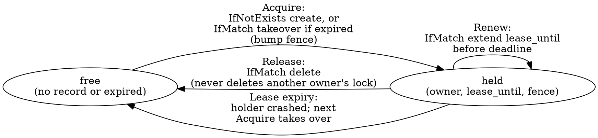

# blobster — Architecture

The design reference for blobster: what the pieces are, how they fit, and the
invariants that hold them together. This is a **living document** — keep it
current as the design evolves, and update it in the same change as the behavior
it describes. For how we work on the project see [`../AGENTS.md`](../AGENTS.md);
for the planning backlog see [`roadmap.md`](roadmap.md); committed work lives in
GitHub issues.

This describes both the implemented foundation and the **target** architecture.
The base `Bucket` API, shared conformance tests, and the `mem`, `file`, `gcs`,
and `s3` drivers are implemented. The `azure` driver plus the higher-level
utilities are planned. The **backend API facts** the design depends on —
conditional writes, cross-region copy, multipart — are verified against the
providers' docs and Go SDKs; the evidence and exact API surfaces live in
[`cloud-backend-research.md`](cloud-backend-research.md).

## What this project is

blobster is a Go library that turns a **blob store into a general-purpose
substrate**. It models any object store as a flat keyspace of string keys and
provides both the ordinary blob operations (read, write, delete, list,
attributes, server-side copy) and a set of higher utilities that teams normally
reach for a second system to get:

- **parallel multipart upload** for large objects,
- a **distributed lock** for mutual exclusion across processes and hosts,
- **cross-region copy** using each cloud's native copy machinery,
- (exploratory) a **queue** and other coordination primitives.

The thesis: a service that already operates an object store should not need a
lock service, a queue broker, or a metadata database to get these primitives.
The more we can express on blob storage alone, the fewer moving parts a
dependent service has to run, secure, and pay for.

blobster occupies the same layer as a low-level object-store client such as
`gocloud.dev/blob`: a flat keyspace, not a domain model. Callers that want
richer nouns (packages, versions, datasets, …) build them *on top of* blobster.
We deliberately diverge from `gocloud.dev/blob` in two ways that matter for the
goal above — see the invariants.

## Invariants

These hold across the whole system; everything below is built to preserve them.

1. **Blob storage is the only dependency.** Every utility — lock, multipart,
   cross-region copy, a future queue — is expressible as blob operations plus
   one conditional-write primitive. There is no external coordinator (no
   ZooKeeper, etcd, Redis, or database). In-memory state (caches, a lock's
   local lease timer) is allowed but must be reconstructible from the bucket.
2. **Explicit construction, caller-owned clients.** A driver is built from a
   pre-configured native SDK client the caller passes in. blobster does **not**
   use the `gocloud.dev/blob` blank-import + URL-opener registration model: no
   import side effects, no ambient cloud-config discovery, no parsing of a
   connection URL. This maximizes the caller's control over how the native
   client is configured (custom endpoint, credentials provider, retryer,
   transport) and makes the dependency graph explicit. blobster never closes a
   client it did not open. The implemented GCS driver follows this shape with
   `gcs.New(client, bucketName, ...)`, where `client` is a caller-owned
   `*storage.Client`.
3. **A prefix is the root.** A `Bucket` is rooted at a key prefix; every key a
   caller supplies is relative to that root, and `Sub(prefix)` returns another
   `Bucket` rooted deeper. A caller can therefore treat any subtree of a
   physical bucket as an independent blobster bucket. blobster's own bookkeeping
   objects (lock records, multipart state) live under a single reserved prefix
   (`.blobster/`) beneath the root so they never collide with caller keys.
4. **Capabilities are explicit and discoverable.** The base `Bucket` interface
   is the common denominator that *every* driver implements. Anything a backend
   may or may not support is modeled as an **optional interface** plus a
   `Capabilities()` descriptor. Callers feature-gate by type-asserting the
   optional interface or checking the descriptor; they never assume a backend
   can do something it has not advertised. A backend that cannot do something
   says so, rather than failing deep in a call.
5. **Conditional writes are the one coordination primitive.** Optimistic
   concurrency — "write/delete this key only if it is absent / only if its
   current version matches" — is the single mechanism on which all coordination
   (the lock today, a queue later) is built. Every production driver must
   provide it; the implemented `mem`, `file`, `gcs`, and `s3` drivers all
   provide it. `file` emulates it with an atomic write-temp + rename committed
   under a per-bucket lock.
6. **`mem` and `file` are first-class, not test doubles.** They implement the
   same interface and the same conditional semantics as the cloud drivers, so
   unit and local-integration tests run the real code paths. There is no mock
   `Bucket` for storage behavior. Both are implemented and run the shared
   conformance suite in the default test run.

## The base `Bucket` interface

The common denominator every driver implements. Keys are opaque strings
relative to the bucket's root prefix. Reads and writes stream.

```
As(i any) bool
Attributes(ctx, key) (*Attributes, error)  // size, version, content-type, mod time, user metadata
Close() error
Copy(ctx, dstKey, srcKey, *CopyOptions) error
Delete(ctx, key, ...Precondition) error
Download(ctx, key, io.Writer, *ReaderOptions) error
ErrorAs(err, i any) bool
Exists(ctx, key) (bool, error)
IsAccessible(ctx) (bool, error)
List(*ListOptions) *ListIterator
ListPage(ctx, pageToken, pageSize, *ListOptions) ([]*ListObject, nextPageToken, error)
NewRangeReader(ctx, key, offset, length, *ReaderOptions) (Reader, error)
NewReader(ctx, key, *ReaderOptions) (Reader, error)
NewWriter(ctx, key, *WriterOptions) (Writer, error)   // streaming write; commit on Close, abort on CloseWithError
ReadAll(ctx, key) ([]byte, error)
SignedURL(ctx, key, *SignedURLOptions) (string, error)
Sub(prefix) Bucket
Upload(ctx, key, io.Reader, *WriterOptions, ...Precondition) error
WriteAll(ctx, key, []byte, *WriterOptions, ...Precondition) error
Capabilities() Capabilities
```

- **`Attributes`** carries an opaque **version token** (an ETag, a GCS
  generation, an Azure ETag) that feeds conditional operations. blobster does
  not interpret it beyond equality.
- **`NewWriter`** returns a `Writer` whose bytes are committed on `Close`; a
  writer abandoned via `CloseWithError`, its cancelable context, or a context
  cancel must **not** leave a partial, readable object. This matters for
  `mem`/`file`, where a naive close would otherwise commit a truncated body, and
  for cloud drivers where uploads have explicit abort/error-close paths.
- **Preconditions** (next section) are accepted by the write and delete paths
  only. `Copy` is an unconditional server-side copy on every backend — it takes
  no preconditions, matching `gocloud.dev/blob` and avoiding a precondition
  affordance that S3's `CopyObject` (which exposes only *source* conditions)
  could not honor on the destination. Callers needing native source conditions
  use `CopyOptions.BeforeCopy`; callers needing a conditional *result* compose
  `Copy` with a conditional `Delete`/`Write`.
- Convenience `ReadAll`/`WriteAll`/`Upload`/`Download` methods wrap the streaming
  pair for small objects and common copy-to/from-stream cases; the streaming
  reader/writer methods remain the core contract.

`NewRangeReader` carries the byte range explicitly; `WriterOptions` carries
content headers, user metadata, optional MD5 validation, and the same
content-type sniffing controls exposed by Go Cloud; `ListOptions` carries prefix
and delimiter; `ListPage` carries page token and page size. The iterator yields
entries (key, size, mod time, is-prefix) and pages internally. Order is
backend-defined — sort caller-side if it matters.

## Conditional writes (the coordination primitive)

A `Precondition` constrains a write or delete to a backend-checked condition,
evaluated atomically at the storage layer:

```
IfNotExists           // create-only; fails ErrPreconditionFailed if the key exists
IfMatch(version)      // succeed only if the current version token equals this one
IfNotMatch(version)   // succeed only if it differs
```

Mapping per backend:

| Backend | `IfNotExists` | `IfMatch` / `IfNotMatch` |
|--------|---------------|--------------------------|
| `s3`    | `If-None-Match: *` on PUT | `If-Match` / `If-None-Match` on the conditional write |
| `gcs`   | `storage.Conditions{DoesNotExist: true}` | `GenerationMatch` / `GenerationNotMatch` |
| `azure` | `If-None-Match: *` | `If-Match` / `If-None-Match` (ETag) |
| `mem`   | in-process compare under a lock | version compare under a lock |
| `file`  | absence check + atomic rename, under a per-bucket lock | sidecar version-token compare + atomic rename, under a per-bucket lock |

A failed precondition is the sentinel `ErrPreconditionFailed`, distinct from
`ErrNotFound`. Conditional support is advertised as the `ConditionalWrites`
capability; a backend without it cannot host the lock or any CAS utility.

All three production backends also support **conditional delete** (S3 natively
since 2025-09; GCS and Azure all along), so a lock's safe release is a single
atomic op — blobster needs no CAS-to-tombstone workaround. Every backend returns
**HTTP 412** on a failed precondition, mapped to `ErrPreconditionFailed`; the
per-SDK error matching is recorded in
[`cloud-backend-research.md`](cloud-backend-research.md).

## Optional capabilities

Each future optional capability is a Go interface a driver may also implement,
paired with a flag in the `Capabilities` descriptor for runtime introspection.
Callers obtain future optional capabilities by type assertion:

```go
if mu, ok := bucket.(blobster.MultipartUploader); ok { /* use native multipart */ }
```

- **`MultipartUploader`** — `NewMultipartUpload`, `UploadPart` (the parts are
  uploaded concurrently by the `multipart` helper), `CompleteMultipartUpload`,
  `AbortMultipartUpload`. Native on S3 (UploadPart), GCS (resumable upload /
  compose), Azure (Put Block + Block List). `mem`/`file` provide a simple local
  implementation so the helper works everywhere.
- **`CrossRegionCopier`** — initiates a backend-native copy that may target a
  different region/bucket and returns a `CopyOperation` handle (some backends
  copy synchronously, some asynchronously — see below).
- **Signed URLs** are exposed on the base bucket because Go Cloud exposes them as
  a basic bucket operation. Drivers that cannot sign return `ErrUnsupported` and
  set `Capabilities().SignedURL` to false. The GCS driver supports signed URLs
  when constructed with `gcs.WithSignedURLs`; the S3 driver always supports them
  via the SDK presigner (GET/PUT/DELETE), so `mem` and `file` are the only
  drivers without signing.
- **`Pinger`** — a cheap reachability probe for readiness checks.

`Capabilities` is a small struct of booleans (`ConditionalWrites`, `Copy`,
`List`, `ListPage`, `RangeRead`, `SignedURL`, and future multipart/cross-region
flags). For future optional interfaces, the interface is the load-bearing
mechanism; the descriptor exists so code can branch, log, or fail fast without a
type assertion per capability.

### Capability matrix (target)

| Capability         | `mem` | `file` | `s3` | `gcs` | `azure` |
|--------------------|:-----:|:------:|:----:|:-----:|:-------:|
| Base `Bucket`      |  ✅   |  ✅    | ✅   |  ✅   |  ✅     |
| `ConditionalWrites`|  ✅   |  ✅    | ✅   |  ✅   |  ✅     |
| `MultipartUploader`|  ✅¹  |  ✅¹   | ✅   |  ✅   |  ✅     |
| `CrossRegionCopier`|  ✅²  |  ✅²   | ✅   |  ✅   |  ✅     |
| Signed URLs        |  ❌   |  ❌    | ✅   |  ✅³  |  ✅     |
| `Pinger`           |  ✅   |  ✅    | ✅   |  ✅   |  ✅     |

¹ local (non-native) implementation — correct, but not a true server-side
multipart. ² intra-process / intra-host copy between two blobster buckets; there
is no "region" to cross, but the interface is satisfied for uniform testing.
³ requires `gcs.WithSignedURLs`.

Implemented today: base `Bucket`, conditional writes, copy, list/list-page,
range reads for `mem`, `file`, `gcs`, and `s3`; signed URLs for `gcs` (with
`WithSignedURLs`) and `s3`. Multipart, cross-region copy, and pinger are
planned.

The `s3` driver wraps a caller-owned `*s3.Client` (`s3.New(client, bucket,
...)`): conditional writes map to `If-None-Match`/`If-Match` on PutObject and
the multipart-complete path; streaming writes go through the SDK's upload
manager over an `io.Pipe`; range reads reopen a `GetObject` per seek. `Copy` is
a server-side `CopyObject` (the base `Copy` is unconditional on every backend).
Conditional delete uses `If-Match` (the only destination condition DeleteObject
accepts).

The `file` driver splits storage into three sibling subtrees under the bucket
root — `data/<key>` for object bytes, `meta/<key>` for a JSON sidecar (content
headers, user metadata, MD5, size, opaque version token), and `tmp/` for
in-flight writes. Keeping metadata and temp files in their own trees means no
caller key can collide with bookkeeping state, so the full string keyspace stays
addressable (unlike a single-tree `<key>.attrs` sidecar scheme, which must
reject or escape keys ending in the sidecar suffix). Writes stream to a temp
file and commit under a per-bucket lock: the precondition is checked against the
committed sidecar, the data file is renamed into place first (it is the
existence source of truth), then the sidecar — and readers take the same lock
while opening committed state, so a half-applied commit is never observed.
`Copy` reads the source bytes and writes them to the destination with a fresh
version token and create/mod time, matching `mem`/`gcs`/`s3` (and diverging from
`gocloud.dev/blob/fileblob`, which preserves the source's metadata) so every
object carries its own identity.

## Testing

The shared `blobtest` conformance suite defines the base bucket contract. The
default test run exercises it against `mem` and `file` (real implementations,
the latter via `t.TempDir()`) and against fake-backed `gcs`/`s3` wrappers
(mem-backed) that verify the prefix/list/precondition plumbing without a network.
The cloud drivers' real backends run the same suite behind the `cloud` build
tag:

```sh
BLOBSTER_GCS_BUCKET=my-test-bucket go test -tags cloud ./gcs
BLOBSTER_S3_BUCKET=my-test-bucket  go test -tags cloud ./s3
```

GCS uses standard Google Application Default Credentials; S3 uses the standard
AWS default credential/region chain (`config.LoadDefaultConfig`). Each test
writes under a unique prefix it attempts to clean up; `BLOBSTER_GCS_PREFIX` /
`BLOBSTER_S3_PREFIX` force all test objects under a chosen prefix. See
[`cloud-tests.md`](cloud-tests.md) for credential and permission details.

## Distributed lock (lease + fencing)

A lock is a **generic algorithm over the conditional-write primitive**, not
per-driver code: the `lock` package works on any `Bucket` that advertises
`ConditionalWrites`. Only the conditional primitive differs between backends;
the lease logic is shared. (Azure has a native `Lease Blob` API, but it yields
no fencing token, so blobster builds the lock on uniform CAS everywhere; a native
lease is at most an optional Azure-specific optimization, never the core
algorithm.)

A lock named `N` is backed by a single record at `.blobster/locks/<N>` holding:

```
owner        — unique id of the current holder (random per acquisition)
lease_until  — absolute deadline after which the lease is considered expired
fence        — monotonically increasing fencing token, bumped on every acquisition
```



- **Acquire** writes the record with `IfNotExists`. If the record exists but its
  `lease_until` is in the past, the acquirer takes over with `IfMatch` on the
  stale record's version and **bumps `fence`**. The compare-and-swap guarantees
  exactly one winner under contention.
- **Hold** runs a background renewer that extends `lease_until` via `IfMatch`
  well before the deadline. If renewal fails (lost the lock, backend error), the
  holder is notified through the lock handle so it can stop work.
- **Release** deletes the record with `IfMatch` on the holder's version, so a
  process can never delete a lock that has since been taken over.
- **Fencing token.** `Acquire` returns the monotonically increasing `fence`. A
  correct holder includes it on writes to the resource it protects (e.g. via an
  `IfMatch`/`IfNotMatch` guard or an application-level check), so a paused holder
  whose lease expired cannot corrupt state after a newer holder has taken over.
  This is the property a TTL-only lock lacks; blobster surfaces the token rather
  than pretending mutual exclusion alone is safe under arbitrary pauses.

Clock handling, the safety margin between renew interval and lease length, and
behavior on backend unavailability are spelled out by the implementing issue and
this section is updated when it lands.

**Backend constraint on timing.** GCS throttles writes to ~1 per second *per
object name*. Because the lock record is a single hot object, lease and renew
intervals must be second-scale (not sub-second), with jittered backoff on
throttling. This effectively sets the floor for the renew/lease margin uniformly
across backends — see [`cloud-backend-research.md`](cloud-backend-research.md).

## Multipart parallel upload

The `multipart` package is a generic helper over the `MultipartUploader`
capability. Given a large source and options (`PartSize`, `Concurrency`), it
splits the source into parts, uploads them with bounded parallelism, and
completes the upload — aborting and cleaning up parts on any error or context
cancellation so a failed upload leaves no orphaned multipart state. Where the
backend lacks native multipart (`mem`/`file`), the local implementation behind
the same interface keeps the helper usable in tests and for small/local
deployments. Resumable uploads (persisting an upload id for later continuation)
are a backlog item, not part of the first cut.

**The interface is backend-honest, not S3-mirrored.** Only S3 has a native
upload-id / part / complete / abort model. GCS uses **compose** (parallel
composite upload over temp components placed under `.blobster/multipart/`; the
S3-compatible XML multipart API is unavailable in the Go SDK, so blobster does
not use it), and Azure uses **block blobs** (`StageBlock` + `CommitBlockList`).
Consequently `uploadID` and the per-part token are **blobster-owned opaque
values** — real handles on S3, synthesized on GCS/Azure — and `Abort` is
**best-effort cleanup**: S3 calls the real abort, GCS deletes its temp
components, Azure relies on uncommitted-block GC. Azure offers no per-upload
isolation on a key, so part/block ids are namespaced by `uploadID`. Per-backend
mechanisms and limits are in
[`cloud-backend-research.md`](cloud-backend-research.md).

## Cross-region copy

The `xcopy` package orchestrates copies via the `CrossRegionCopier` capability,
using each cloud's native server-side mechanism so bytes never round-trip
through the caller:

- **S3** — `CopyObject` for objects within the size limit; `UploadPartCopy`
  (multipart copy) for larger objects. Cross-region/cross-account copies name
  the source bucket explicitly.
- **GCS** — the `rewrite` operation, which handles cross-region and cross-bucket
  copies and is resumable via a rewrite token.
- **Azure** — `Copy Blob`, which is **asynchronous**: it returns a copy id and
  the destination's copy status is polled to completion.

Because some backends copy synchronously and others asynchronously, the API
returns a `CopyOperation` handle with `Wait(ctx)` / `Poll(ctx)`; a synchronous
backend returns an already-complete handle. Cancellation propagates to the
underlying operation where the backend supports it.

**Verified constraints** (see [`cloud-backend-research.md`](cloud-backend-research.md)):
cross-region copy is genuinely server-side on all three, but S3's only works
*within one AWS partition* (`aws` / `aws-cn` / `aws-us-gov` cannot be crossed,
and Transfer Acceleration and VPC gateway endpoints break it); GCS must drive the
`rewrite` token loop (the single-shot `copy` fails on large or cross-location
objects) via the global endpoint; and Azure requires a **read SAS on a
cross-account source** — which must never be logged — and permits only one
pending copy per destination.

## Code layout

The repository stays flat: the user-facing interfaces and shared types live in
the root `blobster` package; everything with substantial implementation gets its
own folder; docs live under `docs/`.

```
blobster/            ← root package: Bucket + optional capability interfaces,
                       Attributes, Precondition/conditions, errors, Capabilities
lock/                ← lease + fencing lock, generic over ConditionalWrites
multipart/           ← parallel-upload helper over MultipartUploader
xcopy/               ← cross-region copy orchestration (Wait/Poll) over CrossRegionCopier
mem/                 ← in-memory driver (reference implementation + test substrate)
file/                ← filesystem driver (local integration + small deployments)
s3/                  ← AWS S3 driver (wraps a caller-owned *s3.Client)
gcs/                 ← Google Cloud Storage driver (wraps *storage.Client)
azure/               ← Azure Blob driver (wraps the container/service client)
internal/            ← shared etag/condition plumbing, not part of the public API
docs/
  architecture.md    ← this document
  roadmap.md         ← planning backlog
  cloud-backend-research.md  ← verified backend API facts behind the design
AGENTS.md            ← how we work  (CLAUDE.md is a symlink to it)
README.md  LICENSE  go.mod  Makefile
```

### Dependency rule

```
              ┌─────────── lock/ ─────────┐
              │           multipart/      │  (utilities: depend on root interfaces only)
              │           xcopy/          │
              ▼                           ▼
        blobster (root: interfaces + types)
              ▲                           ▲
              │                           │
   mem/ file/ s3/ gcs/ azure/  (drivers: implement root interfaces; import only root)
```

- Drivers import **only** the root `blobster` package (and their native SDK).
- Utility packages (`lock`, `multipart`, `xcopy`) depend on the root
  **interfaces**, never on a concrete driver — so they work against any backend
  that advertises the needed capability.
- No driver imports another driver. The arrows point one way.

## Reserved keys and the root prefix

A blobster bucket is rooted at a prefix; all caller keys are relative to it.
blobster's own objects live under a single reserved sub-prefix so they are
invisible to and uncollidable with caller data:

```
<root>/<caller keys…>
<root>/.blobster/locks/<name>          ← lock records
<root>/.blobster/multipart/<id>/…      ← in-flight multipart bookkeeping (where emulated)
```

Listing the bucket's caller-visible contents excludes the `.blobster/` subtree.
`Sub(prefix)` composes prefixes, and each re-rooted bucket gets its own
`.blobster/` namespace beneath its root.

## Errors

Sentinel errors live in the root package and are `errors.Is`-matchable:
`ErrNotFound`, `ErrPreconditionFailed`, `ErrUnsupported` (a capability the
backend does not provide), and the lock's `ErrLockHeld` / `ErrLockLost`.
Drivers map native backend errors onto these so callers write backend-agnostic
error handling.

## Non-goals / deferred

- **A domain model.** blobster is a flat keyspace plus utilities; nouns like
  packages/datasets are the caller's job.
- **Cross-key transactions.** The only atomicity blobster offers is
  single-object conditional writes; there is no multi-key transaction.
- **A POSIX filesystem.** No partial in-place edits, no rename-as-move
  semantics beyond what `Copy` + `Delete` express.
- **Resumable multipart** (persisting an upload id across processes) — backlog.
- **The queue and other coordination primitives** — exploratory; see
  `roadmap.md`.
- **Ambient configuration / driver auto-registration** — intentionally absent;
  see invariant 2.
