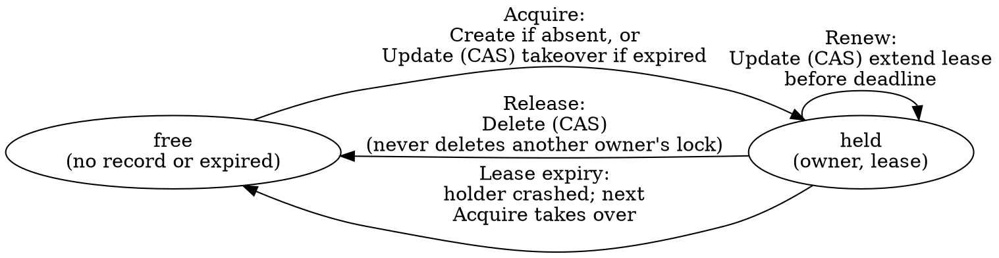
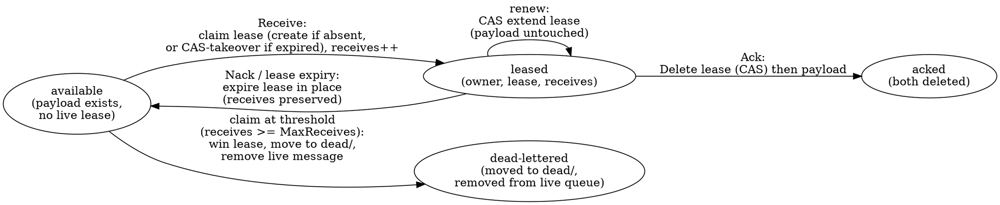

# blobster — Architecture

The design reference for blobster: what the pieces are, how they fit, and the
invariants that hold them together. This is a **living document** — keep it
current as the design evolves, and update it in the same change as the behavior
it describes. For how we work on the project see [`../AGENTS.md`](../AGENTS.md);
for the planning backlog see [`roadmap.md`](roadmap.md); committed work lives in
GitHub issues. For operating blobster in production — request costs, scalability
ceilings, tuning, and the security model's sharp edges — see
[`production.md`](production.md).

This describes both the implemented v0.1 initial release surface and the **target**
architecture. The base `Bucket` API, shared conformance tests, and the `mem`,
`file`, `gcs`, `s3`, and `azureblob` drivers are implemented, as are the lease
lock, cross-region copy, and the blob-backed work queue. The remaining
higher-level utility (multipart parallel upload) is planned. The
**backend API facts** the design depends on —
conditional writes, cross-region copy, multipart — are verified against the
providers' docs and Go SDKs; the evidence and exact API surfaces live in
[`cloud-backend-research.md`](cloud-backend-research.md).

## What this project is

blobster is a Go library that turns a **blob store into a general-purpose
substrate**. It models any object store as a flat keyspace of string keys and
provides both the ordinary blob operations (read, write, delete, list,
attributes, server-side copy) and a set of higher utilities that teams normally
reach for a second system to get:

- **parallel multipart upload** for large objects,
- a **distributed lock** for mutual exclusion across processes and hosts,
- **cross-region copy** using each cloud's native copy machinery,
- a **blob-backed work queue** (competing consumers, at-least-once, approximate
  FIFO), and other coordination primitives.

The thesis: a service that already operates an object store should not need a
lock service, a queue broker, or a metadata database to get these primitives.
The more we can express on blob storage alone, the fewer moving parts a
dependent service has to run, secure, and pay for.

blobster occupies the same layer as a low-level object-store client such as
`gocloud.dev/blob`: a flat keyspace, not a domain model. Callers that want
richer nouns (packages, versions, datasets, …) build them *on top of* blobster.
We deliberately diverge from `gocloud.dev/blob` in two ways that matter for the
goal above — see the invariants.

## Invariants

These hold across the whole system; everything below is built to preserve them.

1. **Blob storage is the only dependency.** Every utility — lock, queue,
   cross-region copy, and planned multipart — is expressible as blob operations plus
   one conditional-write primitive. There is no external coordinator (no
   ZooKeeper, etcd, Redis, or database). In-memory state (caches, a lock's
   local lease timer) is allowed but must be reconstructible from the bucket.
2. **Explicit construction, caller-owned clients.** A driver is built from a
   pre-configured native SDK client the caller passes in. blobster does **not**
   use the `gocloud.dev/blob` blank-import + URL-opener registration model: no
   import side effects, no ambient cloud-config discovery, no parsing of a
   connection URL. This maximizes the caller's control over how the native
   client is configured (custom endpoint, credentials provider, retryer,
   transport) and makes the dependency graph explicit. blobster never closes a
   client it did not open. The implemented GCS driver follows this shape with
   `gcs.New(client, bucketName, ...)`, where `client` is a caller-owned
   `*storage.Client`.
3. **A prefix is the root.** A `Bucket` is rooted at a key prefix; every key a
   caller supplies is relative to that root, and `Sub(prefix)` returns another
   `Bucket` rooted deeper. A caller can therefore treat any subtree of a
   physical bucket as an independent blobster bucket. blobster's own bookkeeping
   objects (lock records, and planned multipart state) live under a reserved
   prefix (`.blobster/`) beneath the root. That prefix is reserved by convention:
   callers must not store application data there. The queue is the deliberate
   exception; it owns a caller-supplied prefix instead of `.blobster/`.
4. **Capabilities are explicit and discoverable.** The base `Bucket` interface
   is the common denominator that *every* driver implements. Anything a backend
   may or may not support is modeled as an **optional interface** plus a
   `Capabilities()` descriptor. Callers feature-gate by type-asserting the
   optional interface or checking the descriptor; they never assume a backend
   can do something it has not advertised. A backend that cannot do something
   says so, rather than failing deep in a call.
5. **Conditional writes are the one coordination primitive.** Optimistic
   concurrency — "write/delete this key only if it is absent / only if its
   current version matches" — is the single mechanism on which all coordination
   (the lock and queue today) is built. Every production driver must provide it;
   the implemented `mem`, `file`, `gcs`, `s3`, and `azureblob` drivers all
   provide it. `file` emulates it with an atomic write-temp + rename committed
   under a per-bucket lock.
6. **`mem` and `file` are first-class, not test doubles.** They implement the
   same interface and the same conditional semantics as the cloud drivers, so
   unit and local-integration tests run the real code paths. There is no mock
   `Bucket` for storage behavior. Both are implemented and run the shared
   conformance suite in the default test run.

## The base `Bucket` interface

The common denominator every driver implements. Keys are opaque strings
relative to the bucket's root prefix. Reads and writes stream.

```
As(i any) bool
Attributes(ctx, key) (*Attributes, error)  // size, version, content-type, mod time, user metadata
Close() error
Copy(ctx, dstKey, srcKey, *CopyOptions) error
Delete(ctx, key, ...Precondition) error
Download(ctx, key, io.Writer, *ReaderOptions) error
ErrorAs(err, i any) bool
Exists(ctx, key) (bool, error)
IsAccessible(ctx) (bool, error)
List(*ListOptions) *ListIterator
ListPage(ctx, pageToken, pageSize, *ListOptions) ([]*ListObject, nextPageToken, error)
NewRangeReader(ctx, key, offset, length, *ReaderOptions) (Reader, error)
NewReader(ctx, key, *ReaderOptions) (Reader, error)
NewWriter(ctx, key, *WriterOptions) (Writer, error)   // streaming write; commit on Close, abort on CloseWithError
ReadAll(ctx, key) ([]byte, error)
SignedURL(ctx, key, *SignedURLOptions) (string, error)
Sub(prefix) Bucket
UpdateMetadata(ctx, key, map[string]string) (newVersion, error)  // unconditional metadata-only update
Upload(ctx, key, io.Reader, *WriterOptions, ...Precondition) error
WriteAll(ctx, key, []byte, *WriterOptions, ...Precondition) error
Capabilities() Capabilities
```

- **`Attributes`** carries an opaque **version token** (an ETag, a GCS
  generation, an Azure ETag) that feeds conditional operations. blobster does
  not interpret it beyond equality.
- **`UpdateMetadata`** changes an object's user metadata **in place** (the body
  is untouched) and returns the object's current version token. It has **replace
  semantics**: the supplied map is the complete desired metadata and replaces the
  prior map in full (a nil/empty map clears it); merge/patch is not portable
  across backends. It is **unconditional** — see
  [Metadata-only update](#metadata-only-update) for why it takes no precondition
  and for the per-backend mechanism.
- **`NewWriter`** returns a `Writer` whose bytes are committed on `Close`; a
  writer abandoned via `CloseWithError`, its cancelable context, or a context
  cancel must **not** leave a partial, readable object. This matters for
  `mem`/`file`, where a naive close would otherwise commit a truncated body, and
  for cloud drivers where uploads have explicit abort/error-close paths.
- **Preconditions** (next section) are accepted by the write and delete paths
  only. `Copy` is an unconditional server-side copy on every backend — it takes
  no preconditions, matching `gocloud.dev/blob` and avoiding a precondition
  affordance that S3's `CopyObject` (which exposes only *source* conditions)
  could not honor on the destination. Callers needing native source conditions
  use `CopyOptions.BeforeCopy`; callers needing a conditional *result* compose
  `Copy` with a conditional `Delete`/`Write`.
- Convenience `ReadAll`/`WriteAll`/`Upload`/`Download` methods wrap the streaming
  pair for small objects and common copy-to/from-stream cases; the streaming
  reader/writer methods remain the core contract.

`NewRangeReader` carries the byte range explicitly; `WriterOptions` carries
content headers, user metadata, optional MD5 validation, and the same
content-type sniffing controls exposed by Go Cloud; `ListOptions` carries prefix
and delimiter; `ListPage` carries page token and page size. The iterator yields
entries (key, size, mod time, is-prefix) and pages internally. Order is
backend-defined — sort caller-side if it matters.

## Conditional writes (the coordination primitive)

A `Precondition` constrains a write or delete to a backend-checked condition,
evaluated atomically at the storage layer:

```
IfNotExists           // create-only; fails ErrPreconditionFailed if the key exists
IfMatch(version)      // succeed only if the current version token equals this one
IfNotMatch(version)   // succeed only if it differs
```

Mapping per backend:

| Backend | `IfNotExists` | `IfMatch` / `IfNotMatch` |
|--------|---------------|--------------------------|
| `s3`    | `If-None-Match: *` on PUT | `If-Match` / `If-None-Match` on the conditional write |
| `gcs`   | `storage.Conditions{DoesNotExist: true}` | `GenerationMatch` / `GenerationNotMatch` |
| `azureblob` | `If-None-Match: *` | `If-Match` / `If-None-Match` (ETag) |
| `mem`   | in-process compare under a lock | version compare under a lock |
| `file`  | absence check + atomic rename, under a per-bucket lock | sidecar version-token compare + atomic rename, under a per-bucket lock |

A failed precondition is the sentinel `ErrPreconditionFailed`, distinct from
`ErrNotFound`. Conditional support is advertised as the `ConditionalWrites`
capability; a backend without it cannot host the lock or any CAS utility.

All three production backends also support **conditional delete** (S3 natively
since 2025-09; GCS and Azure all along), so a lock's safe release is a single
atomic op — blobster needs no CAS-to-tombstone workaround. Every backend returns
**HTTP 412** on a failed precondition, mapped to `ErrPreconditionFailed`; the
per-SDK error matching is recorded in
[`cloud-backend-research.md`](cloud-backend-research.md).

### Metadata-only update

`UpdateMetadata` is a **base `Bucket` operation** (every driver implements it),
not an optional capability: all five drivers can replace an object's user
metadata without re-uploading the body, so there is no backend that lacks it. It
takes no precondition — the supplied map unconditionally replaces the prior user
metadata (empty/nil clears it) and the call returns the object's current version
token (free from every SDK, handy for refreshing a cached token):

| Backend | Mechanism |
|---------|-----------|
| `mem`   | rewrite metadata under the lock, bump the in-process version |
| `file`  | rewrite the JSON sidecar atomically under the per-bucket lock; data file (body + its ModTime) untouched; new version token |
| `s3`    | `CopyObject` onto the same key with `MetadataDirective=REPLACE`; system headers (content-type, …) re-supplied from current attributes because `REPLACE` drops them |
| `gcs`   | `ObjectHandle.Update` with a metadata patch |
| `azureblob` | `Set Blob Metadata`; the fresh ETag is the new version |

**Why no precondition.** A precondition exists for optimistic concurrency, but a
conditional metadata update cannot be honored uniformly: on s3 the version token
is the object **ETag**, a content hash that a metadata-only self-copy leaves
**unchanged**, and s3 has no metageneration analog (the one GCS would lean on).
So "CAS on metadata" would be unenforceable on s3 — a footgun that looks atomic
but silently lets two metadata updates both win. Per invariant 5, a coordination
primitive that blob storage can't express uniformly is the thing to drop, not to
paper over with a per-backend caveat. The use cases that motivate the operation —
in-place tagging, object state, content-property updates — need only an
unconditional replace. A caller that genuinely needs optimistic concurrency on
small state keeps that state in the **body** of a tiny object and uses
`WriteAll`'s CAS, which every backend advances correctly (the same shape the
queue's per-message lease uses). A conditional variant (or an optional
`MetadataUpdater`) can be added later, additively, if a concrete consumer appears
and we know which backends must support it; shipping a half-working one now and
removing it would be the breaking change.

## Optional capabilities

Optional capabilities are Go interfaces a driver may also implement, paired
where useful with a flag in the `Capabilities` descriptor for runtime
introspection. Callers obtain them by type assertion:

```go
if xc, ok := bucket.(blobster.CrossRegionCopier); ok {
	op, err := xc.XCopyFrom(ctx, "dst", srcBucket, "src", nil)
	// observe op.Done() / op.Err()
	_ = err
	_ = op
}
```

- **`CrossRegionCopier`** is implemented today by `s3`, `gcs`, and `azureblob`.
  It initiates a backend-native copy that may target a different
  region/bucket/account and returns a `CopyOperation` handle (some backends copy
  synchronously, some asynchronously — see below).
- **Signed URLs** are exposed on the base `Bucket` because Go Cloud exposes them
  as a basic bucket operation. Drivers that cannot sign return `ErrUnsupported`
  and set `Capabilities().SignedURL` to false. The GCS driver supports signed
  URLs when constructed with `gcs.WithSignedURLs`; the S3 driver supports them
  via the SDK presigner (GET/PUT/DELETE); the Azure driver supports SAS URLs
  when its container client can sign them. `mem` and `file` do not sign.
- **Planned:** `MultipartUploader` and `Pinger` are backlog capabilities, not
  exported v0.1 APIs. When they ship, the optional interface will be the
  load-bearing mechanism and `Capabilities` will grow additively.

`Capabilities` is a small struct of booleans (`ConditionalWrites`, `Copy`,
`List`, `ListPage`, `RangeRead`, `SignedURL`, `CrossRegionCopy`). It exists so
code can branch, log, or fail fast without a type assertion per capability.

### Capability matrix (implemented)

| Capability          | `mem` | `file` | `s3` | `gcs` | `azureblob` |
|---------------------|:-----:|:------:|:----:|:-----:|:-----------:|
| Base `Bucket`       | yes   | yes    | yes  | yes   | yes         |
| Conditional writes  | yes   | yes    | yes  | yes   | yes         |
| Copy                | yes   | yes    | yes  | yes   | yes         |
| List / ListPage     | yes   | yes    | yes  | yes   | yes         |
| Range reads         | yes   | yes    | yes  | yes   | yes         |
| Signed URLs         | no    | no     | yes  | opt-in | yes        |
| Cross-region copy   | no    | no     | yes  | yes   | yes         |

`mem` and `file` deliberately do **not** implement `CrossRegionCopier`: there is
no region to cross and no server-side transfer to orchestrate, so synthesizing
one would add a code path the cloud drivers never share. Cross-region copy is the
one optional capability with no `mem`/`file` stand-in; its handle and async
contract are unit-tested directly in the root package.

Implemented today: base `Bucket`, conditional writes, copy, list/list-page,
range reads for `mem`, `file`, `gcs`, `s3`, and `azureblob`; signed URLs for `gcs`
(with `WithSignedURLs`), `s3`, and `azureblob`; cross-region copy for `s3`
(`CopyObject` plus multipart `UploadPartCopy` above the single-copy size limit),
`gcs` (the `rewrite` operation, whose token loop the GCS client drives internally
for any object size), and `azureblob` (async `Copy Blob` polled to completion,
auto-minting a source read SAS for cross-account copies). Multipart and pinger
are planned.

The `s3` driver wraps a caller-owned `*s3.Client` (`s3.New(client, bucket,
...)`): conditional writes map to `If-None-Match`/`If-Match` on PutObject and
the multipart-complete path; streaming writes go through the SDK's upload
manager over an `io.Pipe`; range reads reopen a `GetObject` per seek. `Copy` is
a server-side `CopyObject` (the base `Copy` is unconditional on every backend).
Conditional delete uses `If-Match` (the only destination condition DeleteObject
accepts).

### S3-compatible backends (Cloudflare R2)

R2 speaks the S3 API, so it needs **no driver of its own**. Per invariant 2 the
`s3` driver is built from a caller-owned `*s3.Client`; the caller points that
client at R2's endpoint (`https://<account-id>.r2.cloudflarestorage.com`, region
`auto`) and uses `s3.New` unchanged. A separate `r2` package would only re-wrap
the same client and duplicate `s3`, so blobster deliberately does not ship one —
the work is configuring the client correctly and knowing which capabilities R2
honors, both verified by `TestCloudBucketR2` in `s3/s3_cloud_test.go`.

- **The SDK checksum default must be turned off.** Recent `aws-sdk-go-v2`
  releases compute a CRC32 request checksum by default; R2 rejects it (`Header
  'x-amz-checksum-algorithm' with value 'CRC32' not implemented`) and every
  `PutObject`/`UploadPart` fails. Build the client with
  `RequestChecksumCalculation` and `ResponseChecksumValidation` set to
  *when-required*. This is the caller's job (invariant 2 keeps blobster out of
  client config), but without it nothing writes.
- **Conditional writes hold.** R2 honors `If-None-Match: *` (create-only) and
  `If-Match`/`If-None-Match` on `PutObject`/`CopyObject`, returning 412, so the
  `ConditionalWrites` capability is real and the lock's acquire / renew / takeover
  path works unchanged.
- **Conditional delete is the one gap.** R2 does not document `If-Match` on
  `DeleteObject` (S3 itself only gained it in 2025-09). The `s3` driver's
  conditional `Delete` therefore cannot be relied on against R2, so the lock's
  *safe release* (delete-only-if-still-mine) loses its guarantee there; the lock
  still functions via lease expiry/takeover, but a holder cannot prove it deleted
  only its own record. `Capabilities()` cannot reflect this — the driver does not
  know it is talking to R2 — so a caller needing the release guarantee must gate on
  the backend, not on the descriptor. The conformance suite's conditional-delete
  case is what surfaces the actual R2 behavior.
- **There is no real cross-region copy.** R2 has no S3-style regions (it is
  global, with optional jurisdictions), so `CopyObject` works intra-bucket but
  there is no region to cross.
- **Multipart and signed URLs hold.** R2 implements native S3 multipart and SigV4
  presigning.

The `file` driver splits storage into three sibling subtrees under the bucket
root — `data/<key>` for object bytes, `meta/<key>` for a JSON sidecar (content
headers, user metadata, MD5, size, opaque version token), and `tmp/` for
in-flight writes. Keeping metadata and temp files in their own trees means no
caller key can collide with bookkeeping state, so the full string keyspace stays
addressable (unlike a single-tree `<key>.attrs` sidecar scheme, which must
reject or escape keys ending in the sidecar suffix). Writes stream to a temp
file and commit under a per-bucket lock: the precondition is checked against the
committed sidecar, the data file is renamed into place first (it is the
existence source of truth), then the sidecar — and readers take the same lock
while opening committed state, so a half-applied commit is never observed.
`Copy` reads the source bytes and writes them to the destination with a fresh
version token and create/mod time, matching `mem`/`gcs`/`s3` (and diverging from
`gocloud.dev/blob/fileblob`, which preserves the source's metadata) so every
object carries its own identity.

The `azureblob` driver wraps a caller-owned `*container.Client` (`azureblob.New(client,
...)`) — an Azure container is the unit that maps to a blobster bucket, so the
container client carries both the account endpoint and the container name, and
no separate name argument is needed. Conditional writes map to
`If-None-Match: *` (create-only) and `If-Match`/`If-None-Match` ETag conditions
via `blob.ModifiedAccessConditions`, on both the write and delete paths. The
version token is the blob's ETag. Streaming writes go through the block-blob
`UploadStream` API over an `io.Pipe`; range reads reopen a `DownloadStream` per
seek. A caller-supplied `ContentMD5` is enforced atomically server-side by
routing the (necessarily bounded) body through a single `Put Blob` with a
transactional Content-MD5 — `UploadStream` cannot validate a whole-object MD5
across blocks, so unvalidated writes stay streaming and never buffer the whole
blob while validated writes buffer. `Copy` is `Copy Blob`, which is
asynchronous: the driver starts the copy and polls the destination's copy
status to completion so the base synchronous `Copy` contract holds (same-account
copies typically complete on the first poll; a few transient `GetProperties`
failures during polling are tolerated before giving up). The same poll-to-
completion helper backs the `CrossRegionCopier` capability (`XCopyFrom`), which
copies from a source in another container/account — see
[Cross-region copy](#cross-region-copy). Signed URLs use the
blob client's `GetSASURL`, which requires the container client to carry a
shared-key credential; because `GetSASURL` signs only the path, permissions, and
expiry, the driver returns `ErrUnsupported` when a signed URL is asked to enforce
a Content-Type rather than silently dropping it.

Unlike the other drivers, `azureblob` **escapes keys and metadata** at the
backend boundary, because Azure cannot address some characters and only accepts
C# identifiers as metadata names. Blob keys hex-escape control characters,
`"`, `#`, `%`, `?`, `\`, a trailing `/`, and the slash in `../` to
`__0x<hex>__`; metadata keys hex-escape to valid identifiers and metadata values
are URL-escaped. The scheme matches `gocloud.dev/blob/azureblob` so blobs and
metadata round-trip between the two, and listing reverses it so callers always
see their original keys. (`s3`/`gcs` pass keys through unescaped — Azure is the
strict outlier.)

## Testing

The shared `blobtest` conformance suite defines the base bucket contract. The
default test run exercises it against `mem` and `file` (real implementations,
the latter via `t.TempDir()`) and against fake-backed `gcs`/`s3`/`azureblob` wrappers
(mem-backed) that verify the prefix/list/precondition plumbing without a network.
The cloud drivers' real backends run the same suite behind the `cloud` build
tag:

```sh
BLOBSTER_GCS_BUCKET=my-test-bucket go test -tags cloud ./gcs
BLOBSTER_S3_BUCKET=my-test-bucket  go test -tags cloud ./s3
BLOBSTER_AZURE_CONNECTION_STRING=... BLOBSTER_AZURE_CONTAINER=my-container go test -tags cloud ./azureblob

# R2 reuses the s3 driver against R2's endpoint (S3-compatible, no separate driver):
BLOBSTER_R2_BUCKET=my-bucket BLOBSTER_R2_ENDPOINT=https://<acct>.r2.cloudflarestorage.com \
  BLOBSTER_R2_ACCESS_KEY_ID=... BLOBSTER_R2_SECRET_ACCESS_KEY=... go test -tags cloud ./s3
```

GCS uses standard Google Application Default Credentials; S3 uses the standard
AWS default credential/region chain (`config.LoadDefaultConfig`); Azure uses a
shared-key connection string (which also enables SAS signing). Each test writes
under a unique prefix it attempts to clean up; `BLOBSTER_GCS_PREFIX` /
`BLOBSTER_S3_PREFIX` / `BLOBSTER_AZURE_PREFIX` force all test objects under a
chosen prefix. See [`cloud-tests.md`](cloud-tests.md) for credential and
permission details.

## Distributed lock (lease)

A lock is a **generic lease algorithm over one conditional-write primitive**,
not per-driver code. The lock lives in the **root `blobster` package** (it is a
core coordination primitive and depends only on the root contract, so it is
surfaced at the top level rather than in its own folder, unlike the planned
heavier, capability-gated `multipart` utility). A `Locker` is constructed with
`blobster.NewLocker(bucket, …)` over any `blobster.Bucket` that advertises
`ConditionalWrites`, so a caller builds a native client once and uses the same
driver for both blob operations and locking. Internally the lease logic needs
only four conditional ops on a single key — read, create-if-absent,
CAS-if-version-matches, delete-if-version-matches — expressed directly over the
bucket's `Attributes`/`WriteAll`/`Delete` and reusing the package's existing
sentinels (`ErrNotFound`, `ErrPreconditionFailed`); it has no error vocabulary
of its own. (Azure has a native `Lease Blob` API, but blobster builds on uniform
CAS everywhere; a native lease is at most an optional Azure-specific optimization
reachable via `As`, never the core algorithm.)

`NewLocker` acquires many distinct locks by key from one bucket+location
(`WithLockPrefix`, default `.blobster/locks/`). `Acquire`/`TryAcquire` take a key
and an optional `WithLockOwner` (a random owner is generated otherwise). The
opaque version token (ETag/generation) is handled entirely inside the package —
callers never see it. The background renewer runs on an **internal context**,
independent of the context passed to `Acquire`: it is stopped only by `Release`
or by losing the lease, so a request-scoped acquire context cancelling does not
kill the renewer.

A lock named `N` is backed by a single record at `.blobster/locks/<N>` whose
state lives in the object's **user metadata** (empty body), so one `Get`
(`Attributes`) returns both the state and the version token atomically:

```
owner        — id of the current holder (advisory; for logs / "who holds this")
lease         — absolute deadline (RFC3339Nano) after which the lease is expired
```



- **Acquire** creates the record if absent. If it exists but its `lease` is in
  the past, the acquirer takes over with a CAS on the stale version. The
  compare-and-swap guarantees exactly one winner under contention;
  `TryAcquire` returns `ErrLockHeld` when a live holder owns it, while `Acquire`
  retries with jittered backoff until acquired or the context is done.
- **Hold** runs a background renewer that extends `lease` via CAS each renew
  interval. The renewer self-expires conservatively: if its own deadline passes
  before a renew lands (or a renew CAS conflicts because someone took over), it
  declares the lock lost via the handle's `Done()`/`Err()` — liveness only, see
  below.
- **Release** stops the renewer and waits for it to exit (so no in-flight renew
  can race the delete), then deletes the record only if it still names this
  owner — so a process can never delete a lock that has since been taken over,
  and an explicit Release leaves no stale record holding the lock until expiry.
  It is idempotent and a safe no-op once the lock was lost. Its returned error
  is authoritative for whether cleanup succeeded; `Err` is reserved for the
  held-time lost-vs-clean distinction.

**No fencing token — and why.** This is a lease lock, not a fencing lock. It
gives mutual exclusion in the common case and self-heals on crash, but it does
**not** protect against a holder that pauses (GC, VM freeze) past its lease and
resumes after a successor starts — a frozen process cannot observe its own
freeze, so no self-check (`IsExpired`-style) can be safe, and the handle's
loss signal is therefore documented as liveness, never a correctness guard. We
deliberately do not surface a fencing token: the lock's purpose is to coordinate
critical sections that span **multiple objects or external systems**, where a
single monotonic token would only partially help and would force every protected
resource to implement fence-checking. Safety under arbitrary pauses is the
caller's responsibility — keep sections short and make effects idempotent. Note
that when the protected resource is a single blobster object, its own
conditional write (`IfMatch` on the object's version) already orders writers and
rejects a stale holder's overwrite, so no separate token is needed there.

**Backend constraint on timing.** GCS throttles writes to ~1 per second *per
object name*. Because the lock record is a single hot object, lease and renew
intervals are second-scale (default lease 15s, renew lease/3), not sub-second,
with jittered acquire backoff. This sets the floor for the renew/lease margin
uniformly across backends — see
[`cloud-backend-research.md`](cloud-backend-research.md).

## Multipart parallel upload

The multipart helper is **planned**, not part of the v0.1 API. The
intended shape is a `multipart` package over a future `MultipartUploader`
optional capability. Given a large source and options (`PartSize`,
`Concurrency`), it will split the source into parts, upload them with bounded
parallelism, and complete the upload — aborting and cleaning up parts on any
error or context cancellation so a failed upload leaves no orphaned multipart
state. Where the backend lacks native multipart (`mem`/`file`), a local
implementation behind the same interface should keep the helper usable in tests
and for small/local deployments. Resumable uploads (persisting an upload id for
later continuation) are a backlog item beyond the initial helper.

**The interface is backend-honest, not S3-mirrored.** Only S3 has a native
upload-id / part / complete / abort model. GCS uses **compose** (parallel
composite upload over temp components placed under `.blobster/multipart/`; the
S3-compatible XML multipart API is unavailable in the Go SDK, so blobster does
not use it), and Azure uses **block blobs** (`StageBlock` + `CommitBlockList`).
Consequently the future `uploadID` and per-part token should be
**blobster-owned opaque values** — real handles on S3, synthesized on GCS/Azure —
and `Abort` should be **best-effort cleanup**: S3 calls the real abort, GCS
deletes its temp components, Azure relies on uncommitted-block GC. Azure offers
no per-upload isolation on a key, so part/block ids would be namespaced by
`uploadID`. Per-backend mechanisms and limits are in
[`cloud-backend-research.md`](cloud-backend-research.md).

## Cross-region copy

Cross-region copy is an **optional capability on the driver**, not a separate
orchestration package. A backend that can copy server-side to another
region/bucket/account implements `CrossRegionCopier.XCopyFrom`, which takes the
**destination key, a separate source `Bucket`, and the source key**, and uses the
cloud's native mechanism so bytes never round-trip through the caller:

- **S3** — `CopyObject` for objects within S3's single-copy size limit (5 GiB);
  multipart `UploadPartCopy` (concurrent ranged part-copies, source metadata
  mirrored onto the destination, abort on any failure or cancellation) for
  larger objects. The copy is issued against the **destination** bucket's client
  and names the source bucket in `x-amz-copy-source`; the source `Bucket` is just
  identity, so no second client is threaded. *(Implemented.)*
- **GCS** — the `rewrite` operation, which handles cross-region and cross-bucket
  copies and is resumable via a rewrite token. The Go `storage.Copier.Run` drives
  that token loop internally, so one call copies any object size with no manual
  multipart path; the rewrite is issued by the destination's client and names the
  source bucket, so the destination credential must have read on the source (the
  source `Bucket`'s own client is unused), mirroring the S3 model. *(Implemented.)*
- **Azure** — `Copy Blob`, which is **asynchronous**: it returns a copy id and
  the destination's copy status is polled to completion. The copy is issued by the
  **destination** container's client against a source URL; a same-account source
  uses its plain blob URL, while a cross-account source carries a short-lived read
  SAS the driver mints from the **source** bucket's own client (see below). One
  poll-to-completion helper backs both the base `Copy` and the cross-region path.
  *(Implemented.)*

**The capability returns immediately with an async handle.** `XCopyFrom` does not
block; it returns a `CopyOperation` whose `Done()` channel closes when the copy
reaches a terminal state and whose `Err()` then reports success, failure, or
cancellation. The handle and helper (`StartCopyOperation`) live in the **root
`blobster` package** — like the lock — because the optional interface (on the
driver) must reference the handle type, and a driver may import only root. A
driver runs its native copy (which may itself block, as S3's does, or poll, as
Azure's does) inside the goroutine `StartCopyOperation` manages, so the
"start-and-observe" shape is uniform across synchronous and asynchronous
backends without per-driver channel plumbing. The `ctx` passed to `XCopyFrom`
governs the **lifetime of the whole copy**, not just the call; cancelling it
requests best-effort cancellation, and because the transfer is server-side the
destination may or may not exist afterward. A synchronous setup failure (e.g. the
source is a different backend — `ErrUnsupported`) is returned directly and yields
no handle.

**The handle is in-memory only — for now, by construction choice.** Today, if the
process exits while a copy is in flight, its outcome cannot be observed: there is
no persisted record to re-attach to. This is the default and the only mode in the
first cut, but it is deliberately *not* a dead end. The intended evolution is a
**driver-construction option** (e.g. a `WithPersistentCopyHandle`-style option on
the cloud driver) that opts a bucket into persisting an operation record — plus
each backend's resume token (S3 multipart upload-id, GCS rewrite token, Azure
copy-id) — under `.blobster/xcopy/`, so another process (or the same one after a
restart) can recover or re-poll an in-flight copy. The current API is shaped to
keep this purely additive: `XCopyFrom` still returns a `CopyOperation`, and the
persistent mode would back that same handle with bucket state rather than change
the signature. It pays off mainly for the genuinely resumable backends, so it is
a future opt-in rather than the default — not ruled out, just not the first cut
(S3's atomic `CopyObject` has nothing to resume regardless).

**Azure cross-account needs a source read-SAS — and minting it is the same
capability as a signed URL.** Azure's `Copy Blob` authorizes the source read
against the **destination**, so within one storage account no SAS is needed (the
destination credential can already read the source — this covers cross-container
and cross-region-within-one-account copies). Across storage accounts it can't, so
the source URL must carry a short-lived read SAS minted from the **source's** own
credential (the SAS is a bearer credential and must never be logged). The root
`CopyOptions` can't express this — it needs the source's credential, not the
destination's — and it doesn't have to: `XCopyFrom` already receives the source as
a `Bucket`, so after type-asserting it to `*azureblob.Bucket` the driver mints the
SAS from the **source bucket's own client**, via the same `GetSASURL` path
`SignedURL` uses. No new caller option is required.

A key consequence: **minting the cross-account source SAS and generating a signed
URL are one and the same operation** — both go through `GetSASURL` and both need a
**Shared Key credential** on the source client. So there is no bucket that can
produce a signed URL but not a cross-account copy SAS, nor the reverse. The driver
distinguishes same- vs cross-account by comparing the source and destination
client URL **hosts** (a storage account is one host; this can't tell apart
path-style emulator accounts, which is not a target). The SAS expiry must outlive
the server-side copy; it defaults to one hour and is tunable with
`azureblob.WithCrossAccountSASExpiry`.

**Expectation on the Azure storage client.** A cross-account `XCopyFrom` requires
the **source** bucket's `*container.Client` to hold a **Shared Key** credential
(e.g. built via `NewClientFromConnectionString` or a shared-key credential) so it
can self-sign the read SAS — exactly the same requirement as `SignedURL`. A source
client built from an **Entra ID / token credential** or from a SAS cannot sign,
and the copy fails for the same reason a signed URL would. Same-account copies and
the **destination** client have no such requirement (the destination client only
issues `Copy Blob`).

The token-credential gap is a **future cross-cutting enhancement, not a
cross-region-copy-specific one**: signing from an Entra ID credential needs a
*user-delegation key* (`GetUserDelegationCredential`, plus the "Storage Blob
Delegator" RBAC role), which the current `SignedURL` does not implement either.
Adding it would light up both signed URLs and cross-account copy at once; it is
tracked in the roadmap.

**Verified constraints** (see [`cloud-backend-research.md`](cloud-backend-research.md)):
cross-region copy is genuinely server-side on all three, but S3's only works
*within one AWS partition* (`aws` / `aws-cn` / `aws-us-gov` cannot be crossed,
and Transfer Acceleration and VPC gateway endpoints break it); GCS must drive the
`rewrite` token loop (the single-shot `copy` fails on large or cross-location
objects) via the global endpoint; and Azure requires a **read SAS on a
cross-account source** — which must never be logged — and permits only one
pending copy per destination.

## Blob-backed work queue

The work queue is a **utility built solely on blob storage** — competing
consumers, at-least-once delivery, approximate FIFO — and is the next
coordination primitive after the lock. Like the lock, it **lives in the root
`blobster` package** (not its own folder): it depends only on the root contract
and the conditional-write primitive, has no cloud-specific logic, and is a core
coordination primitive, so surfacing it at the top level keeps the dependency
graph one-directional — the same reasoning that keeps the lock in root. A `Queue`
is constructed with `blobster.NewQueue(bucket, prefix, …)` over any bucket that
advertises `ConditionalWrites`.

**Two objects per message — "the lock, applied per message."** Each message is a
pair of objects under a caller-supplied prefix the queue owns wholesale:

```
<prefix>/msg/<id>     payload: written once at enqueue, immutable, streamed (any
                      size); user attributes live in its metadata
<prefix>/lease/<id>   lease record: empty body, metadata {owner, lease
                      (RFC3339Nano deadline), receives}; the per-message "lock"
<prefix>/dead/<id>    dead-lettered message (only when WithMaxReceives is set):
                      the payload, its user attributes, and the final receive
                      count, retained for inspection after the message is removed
                      from the live queue
```

Splitting the immutable payload from the mutating lease is the load-bearing
decision. `WriteAll` is whole-object, so a single object holding both would force
every heartbeat to re-buffer and re-upload the payload. With them split, the
heartbeat rewrites only the tiny, empty-bodied lease record — so payloads stream
at any size with no buffering (honoring "stream, don't buffer"), and the renew
path is **exactly the lock's**. Because user attributes live on the payload
object and lease state on the separate lease object, there is no
reserved-metadata clash between them in the live message. (The dead record is the
one place the two are merged onto a single object, where the receive count
reserves the `receives` metadata key — see [Dead-letter](#dead-letter--max-receives).)
This needs **no new interface primitive and touches no shipped behavior**.



- **Enqueue** writes the payload create-only (`IfNotExists`) and streams it; no
  lease record exists yet. *Available* = payload present with no live lease.
- **Receive/TryReceive** lists a head window of `<prefix>/msg/`, picks a
  candidate, and acquires its lease — this is the lock's `tryAcquire` plus a
  `receives` field: create-if-absent (`receives=1`), CAS-takeover of an expired
  lease (`receives++`), or skip a live one. `Receive` blocks with exponential
  jittered backoff while empty; `TryReceive` returns `ErrNoMessages`. This
  mirrors `Acquire`/`TryAcquire`. A held `Message` runs the lock's background
  renewer on an internal context and surfaces a lost lease via `Done()`/`Err()`.
- **Ack** stops the renewer, then deletes the **lease first** (CAS, only if still
  ours) and the **payload second**. Lease-first ordering means a crash between the
  two deletes costs at most one extra, idempotent redelivery and **never** leaves
  an orphaned lease that discovery would not revisit (payload-first would orphan
  the lease). The same non-atomic window means even an uncrashed concurrent
  consumer can occasionally redeliver — at-least-once is the contract, not an
  edge case.
- **Nack** expires the lease in place (deadline = now), **preserving** `receives`
  (never resetting it, so a poison message cannot loop forever at count 1); the
  message is immediately reclaimable.
- **Redelivery** is identical to lock takeover: a crashed worker stops renewing,
  its lease deadline passes, and the next claimer CAS-takes-over with `receives++`.
- **Dead-letter** (opt-in via `WithMaxReceives(n)`) caps redelivery: once a message
  has been delivered `n` times, the next claim that would redeliver it moves it
  aside to `dead/` instead. See [Dead-letter](#dead-letter--max-receives) below.

### Dead-letter / max-receives

Poison-message handling is opt-in through `WithMaxReceives(n)`; unset (`n <= 0`,
the default) the queue redelivers forever and a caller can build its own policy
from `Message.Receives`. The receive count already lives in the per-message lease
record and is maintained by the claim/takeover path, so dead-letter adds only a
threshold check and the move — no new lease state, no sweeper.

**The decision rides the existing takeover.** A brand-new claim (create branch,
`receives=1`) never dead-letters. On a takeover of an *expired* lease, the
claimer reads the prior `receives`; if `MaxReceives > 0` and `receives >=
MaxReceives`, it dead-letters instead of incrementing-and-delivering. The
off-by-one: with `MaxReceives = K` a message is delivered exactly `K` times
(`receives` 1..K), and the **(K+1)th** claim — the one that observes the count
already at K — moves it aside. The dead record's final count is therefore `K`.

**Lazy, single-mover, no sweeper.** The move is done by the worker that would
otherwise have redelivered the message, with no background process:

1. **Win the lease first** — a CAS takeover of the stale lease (`receives` left at
   its prior value, since this is not a delivery). The winner now holds a *live*
   lease, which makes it the **sole mover**: every contender that lists the same
   message sees a live holder and skips, so exactly one worker performs the
   transition under contention.
2. **Write the dead record** at `dead/<id>`, carrying the payload, its user
   attributes, and the final receive count.
3. **Remove the live message** — delete the **payload first, then the lease.**
   This is the *inverse* of Ack's lease-first ordering, and deliberately so: the
   mover holds a live lease throughout, so deleting the payload first cannot
   resurrect the message (no contender can claim a live-leased message, and once
   the payload is gone it is not listed at all). A crash *before* the payload
   delete is recoverable — the payload and the mover's lease both survive with the
   count still at the threshold, so once that lease expires the next claim re-runs
   the (idempotent) move and completes it. A crash *between* the payload and lease
   deletes leaves an empty-bodied orphan lease that discovery (which lists `msg/`)
   never revisits — harmless and it never resurrects the dead-lettered message,
   the one residue the lease-first Ack ordering avoids but the dead-letter cannot,
   because here the message must *not* come back.

**Why a streamed move, not a server-side `Copy`.** The base `Copy` is server-side
but copies only the source object's own metadata — the payload's user attributes,
not the lease's `receives` — and the interface has no body-free metadata write. To
land the payload, its user attributes, *and* the final receive count in one
self-describing dead record, the move streams the payload into `dead/<id>` with
`receives` merged into the metadata. This reserves the `receives` metadata key on
the dead record: a caller attribute of that name is shadowed by the count there
(documented on `WithMaxReceives` / `EnqueueOptions.Attributes`), the one merge
point the live msg/lease split otherwise avoids. This still honors "stream, don't
buffer" — it never materializes the
whole body — at the cost of routing the bytes through the mover rather than a pure
server-side transfer. For the rare, terminal poison path that trade is worth a
single self-describing record and no new interface primitive; a future
`CopyOptions` metadata-override could restore the server-side transfer additively
if it ever matters.

**Deferred: redirect to a separate queue.** `WithDeadLetterQueue(*Queue)` (route
poison messages into another queue rather than the in-prefix `dead/`) was
considered and left out of this cut — the in-prefix `dead/` subtree is the simpler
default and nothing yet needs the redirect. It stays purely additive if a need
appears.

**The lease engine is a focused parallel of the lock, not a dependency on it.**
The per-message lease is the lock's algorithm with a richer record (it adds
`receives`) and a non-deleting "expire on nack." The public `Locker` exposes
neither, so the queue implements its own claim/takeover/renew/expire/
conditional-delete (in `queue.go`/`queuemessage.go`) that mirrors `locker.go`,
rather than depend on `Locker`. Both sit side by side in the root package — the
queue's lease helpers are unexported and prefixed (`queueLeaseExpired`,
`queueParseReceives`, …) so they coexist with the lock's without collision. This
keeps the shipped lock untouched and the queue self-contained, at
the cost of paralleling the renewer logic. If a third lease user appears, the
shared engine gets extracted then — generalizing `Locker` now was rejected for
the same reason the storage design avoids touching shipped code.

**Discovery and contention.** `Receive` lists the first `HeadWindow` keys under
`<prefix>/msg/` (lexically sorted ≈ oldest-first, since ids are time-sortable),
then iterates from a jittered offset within a small front window so workers
prefer the earliest message without all stampeding the single first one.
Leased-but-unacked payloads stay listed until acked, so the window must be sized
above the worker count or they crowd out available messages. Claim-race losers
(`ErrPreconditionFailed`) fall through to the next candidate; an empty pass backs
off exponentially with jitter up to a cap.

**Ids sort by time.** A message id is an epoch-millisecond timestamp joined to a
random UUID by a dash (e.g. `1767225600000-<uuid>`). The decimal timestamp is the
load-bearing part: lexical order tracks creation time, which gives the
approximate-FIFO listing order, with no hot shared counter; the UUID only breaks
ties within a millisecond. The timestamp is width-padded to 13 digits — the
natural, and constant, width of epoch milliseconds from 2001 to 2286 — so the
string sorts in the same order as the number. (An unpadded value that crossed a
digit-count boundary, or an `RFC3339Nano` stamp, which trims trailing zeros, would
not sort lexically.) The clock is injectable for deterministic tests.

**The prefix is required and owned wholesale.** Unlike the lock and multipart —
whose bookkeeping lives under the reserved `.blobster/` subtree so it never
collides with caller keys — the queue's prefix is a **caller-supplied required
argument with no default**, and the queue owns everything beneath it (`msg/` and
`lease/`). There is nothing to collide with because the caller dedicates the
prefix to the queue. **Sharding is the caller's composition**: run N queues over
N prefixes to spread load past a single prefix's request-rate ceiling. `NewQueue`
returns `ErrInvalidQueuePrefix` for an empty or subtree-escaping prefix (the one
construction error; the lock validates its key per-acquire instead, but the
queue's prefix is fixed at construction, so it is validated there).

**Errors.** The queue reuses `ErrNotFound`/`ErrPreconditionFailed` internally to
interpret conditional ops (like the lock) and adds four of its own:
`ErrNoMessages` (`TryReceive` on an empty queue), `ErrMessageLost` (the held
lease was lost), `ErrInvalidQueuePrefix`, and `ErrInvalidMessageID`
(`EnqueueWithID` given an empty or escaping id).

**Documented limitations.** Single-prefix request-rate ceiling (shard via
multiple queues); idle polling cost (there is no push/long-poll on blob storage);
approximate-only ordering (concurrency, clock skew, and redelivery break strict
FIFO); at-least-once with **mandatory handler idempotency**; auto-renew means a
wedged-but-alive worker holds its one message until process death (head-of-line
on that message only, not a queue stall); and two objects per message with a
non-atomic two-delete ack (a crash — or a concurrent claim — in the mid-ack
window costs one idempotent redelivery, never an orphan). **Dead-letter /
max-receives is opt-in** via `WithMaxReceives` (see
[Dead-letter](#dead-letter--max-receives)); unset, a poison message is
redelivered forever and the surfaced never-reset `receives` count lets a caller
build its own policy. When set, a crash in the dead-letter move's narrow
delete window can leave one empty-bodied orphan lease (harmless, never
resurrects the message); redirecting dead letters to a *separate* queue is
deferred.

### Dedup-keyed enqueue (`EnqueueWithID`)

`Enqueue` mints a fresh time-sortable id per call, so a producer that retries —
or two producers racing on the same logical event — writes distinct messages
and double-delivers. `EnqueueWithID` closes that hole: it writes the payload
under a **caller-supplied id, create-only** (the same `IfNotExists` write
`Enqueue` already uses), and when a payload with that id already exists it
reports `existed=true` as a no-op success instead of surfacing the precondition
failure. Re-enqueuing the same logical message is therefore idempotent — the
exactly-once-ish enqueue an at-least-once producer needs, and the load-bearing
primitive for the replication watcher's non-atomic "enqueue, then advance
cursor" step (see [Fan-out replication](#fan-out-replication-the-queue-watcher)).

Two documented consequences of supplying ids:

- **The caller owns ordering.** Approximate-FIFO discovery relies on
  time-sortable ids; a supplied id outside the `<13-digit-millis>-<suffix>`
  shape lands at its arbitrary lexical position, carries no timestamp, and is
  therefore never trimmed by retention and never lag-gated by the tail. (The
  watcher supplies the *leader's* time-sortable id, so replicated order is
  preserved.)
- **"Acked and gone" is not tombstoned.** Create-only protects only against a
  currently existing payload: once a message is acked (or trimmed) its id is
  free again, and a late re-enqueue re-creates it. There is deliberately no
  persisted seen-set — that role belongs to the caller (for the watcher, its
  forward-only cursor, which never rewinds past replicated history).

The id must be a non-empty single path segment (no `/`, no `..`, not `.`);
otherwise `ErrInvalidMessageID`.

### Retention / `Trim` — the broadcast-log janitor

`WithRetention(d)` plus `Trim` is the opt-in lifecycle policy: one `Trim` call
makes a single bounded pass that **range-deletes messages older than the
horizon** (now − d) — payload and paired lease — plus residual over-horizon
lease records whose messages are already gone (crash residue from partial acks,
dead-letter moves, or earlier trims). It exists because a **broadcast log has
no consumer to ack it empty** — followers tail the leader's queue read-only, so
without a janitor the log grows forever — and it doubles as cleanup for
abandoned messages on ordinary queues.

Mechanics, all riding existing invariants:

- **The id carries the time, so the horizon is a lexical key range.** Ids embed
  a 13-digit epoch-millisecond prefix; "older than the horizon" is a forward
  scan of `msg/` that stops at the first id at or past the cutoff. No
  per-object attribute reads, no lease-ack — this is a janitor over the
  keyspace, not a consumer.
- **Bounded and caller-scheduled.** Each pass removes at most `DefaultTrimBatch`
  entries; the owner calls `Trim` on its own schedule (explicit `Trim` was
  chosen over a managed background janitor — simplest and most testable; a
  managed runner stays an additive follow-up). Concurrent passes are safe
  (deletes are idempotent, counts may overlap); a single-mover can be composed
  by gating `Trim` behind the lease lock.
- **Payload-first per message.** Deleting the payload before its lease means a
  half-trimmed message is never re-exposed to discovery (which lists `msg/`);
  the crash residue is a lease without a payload, removed by the residual sweep
  of a later pass.
- **The horizon is a hard policy, not a liveness check.** A message older than
  the horizon is removed even if a worker currently holds its lease (the worker
  observes `ErrMessageLost`), so the retention must comfortably exceed
  worst-case queue dwell plus processing time — and, for a replicated log,
  worst-case follower lag plus downtime, or a lagging follower's cursor falls
  off the log and it must re-bootstrap via a reconciliation sweep (the
  documented floor). A watermark-based horizon (trim only up to the minimum
  follower cursor) is a possible future addition when a back-channel exists.

### `Tail` — the read-only log view

`Queue.Tail()` returns a **read-only, forward view over the message log**: it
surfaces messages whose ids sort after a caller-supplied cursor, in id order,
without taking a lease, acking, or writing anything. This is the queue's second
consumption mode: where `Receive` is a **competing consumer** (claims a lease,
hides the message from others, acks it away), a tailer is a **broadcast
reader** — every tailer sees every message, and the source bucket can be one
the tailer can only read. The asymmetry is exactly what fan-out replication
needs: followers can read the leader's bucket but cannot write lease or ack
records into it.

- **The cursor is the caller's.** `Page(ctx, cursor, n)` returns up to `n`
  messages with ids after `cursor` plus the id to resume from; the caller
  persists it durably (the watcher stores it in its own bucket). `Tail` itself
  is stateless.
- **Cursor lag closes the late-commit hole.** A message id is stamped at
  enqueue, but its payload commits when the streamed write finishes — so a
  fast-committing newer message could pull the cursor past a slower,
  earlier-stamped one still in flight. The tail therefore surfaces only
  messages stamped at or before now − lag (`WithTailLag`, default
  `DefaultTailLag`): by the time the cursor can pass an id, anything stamped
  earlier has had the whole lag window to commit. The window must exceed
  worst-case payload write latency plus producer clock skew; the gate relies on
  time-sortable ids (a caller-shaped id surfaces as soon as it is listed, with
  no lag protection).
- **`TailMessage` is `Message` minus the lease**: id, lazily read attributes,
  and the streamed payload — no Ack/Nack, no renewer, no lost signal. Reads hit
  the immutable payload directly and report `ErrNotFound` once it is acked or
  trimmed away.
- **Cost tracks the retained log.** `Page` scans the `msg/` keyspace from its
  head each call (the base `ListPage` has no start-after, and a page token is
  not synthesizable portably), skipping keys at or before the cursor, so the
  scan is bounded by the log's retained length — pair the tailed queue with
  retention so both the log and the scan stay bounded. A `StartAfter` listing
  option (natively supported by S3 and GCS) is a possible future optimization;
  it would be additive.

The leader side stays a full `Queue` rather than a lighter publish-only `Log`
type: enqueue-only use *is* the publish mode (nothing forces a publisher to
call `Receive`), and a second type would duplicate the construction surface for
no new capability.

## Fan-out replication (the queue watcher)

The **watcher** composes the three queue extensions above into the fan-out
replication bridge: one leader region enqueues each change **once** into its
queue (used as a broadcast log — `Enqueue` only, nobody acks it); every
follower region runs a `Watcher` that **tails the leader's log read-only and
re-enqueues each message into a local queue**, where existing workers consume
it normally. The leader's write cost is **O(1) in the number of followers** —
the alternative (the leader enqueuing into one queue per follower)
write-amplifies the leader by the follower count — and each region's fan-in
happens locally, off the leader's critical path. The same `Queue` type serves
both modes: publish/broadcast on the leader (followers cannot write its bucket,
so it has no competing consumers) and ordinary competing-consumers on each
follower.

The watcher lives in the **root package** beside the lock and the queue — it
depends only on the root contract plus `Queue`, `Tail`, and `Locker`, and
carries no cloud-specific logic. Construction is
`blobster.NewWatcher(sourceTail, localQueue, locker, …)`; `Run(ctx)` is the
whole lifecycle (acquire, resume, replicate until ctx is done — `Start`/`Stop`
would only wrap the same loop in state).

```
leader bucket                       follower bucket
  events/msg/<id>   ──tail──▶  Watcher ──EnqueueWithID(id)──▶ events/msg/<id>
  (broadcast log,              (singleton                      (local queue,
   Trim'd by owner)             via lease lock)                 competing workers)
                                   │
                                   └─ cursor CAS'd at .blobster/watch/<name>/cursor
```

- **Singleton per watch name, HA via the lease lock.** Every instance calls
  `Run`; exactly one holds the lock (`watch/<name>` under the caller's locker)
  and replicates while the rest stand by blocked on acquisition. When the
  holder dies, its lease expires and a standby takes over, resuming from the
  durable cursor — no gap, because the cursor is persisted only after the
  messages it covers are enqueued locally.
- **The cursor lives with the election.** It is stored in the **locker's
  bucket** (the follower's own, writable bucket) at
  `.blobster/watch/<name>/cursor`, deliberately: the election and the cursor
  must travel together for a takeover to resume exactly where the holder
  stopped, and the state is reconstructible from the bucket (invariant 1).
- **The cursor is CAS-guarded, so a paused zombie can never rewind a
  successor.** The holder persists the cursor with `IfMatch` on the version it
  last wrote (create-only the first time). A stale holder that resumes after a
  takeover trips the precondition on its first persist and stands down —
  returning to contention — and the messages it replayed meanwhile were
  create-only no-ops. This is the same "the protected object's own conditional
  write orders writers" pattern the lock documents in lieu of fencing tokens.
- **"Enqueue, then advance cursor" is non-atomic but idempotent.** A crash (or
  takeover) between the two replays the page on resume; `EnqueueWithID` under
  the **leader's message id** makes each replay a no-op while the message still
  exists locally. The residual window — a replicated message that local workers
  already acked being re-created by a replay — requires the cursor to move
  backward, which the watcher never does; only a manual rewind reopens it
  (at-least-once is the end-to-end contract regardless).
- **Payloads flow through the watcher, provider-agnostically.** Replication is
  a plain cross-bucket streamed read + create-only write — no
  `CrossRegionCopier` dependency — so it works `mem`→`mem` in tests and, e.g.,
  `s3`→`gcs` in production. A source message that vanishes between listing and
  copying (acked or trimmed away) is skipped.
- **Pair the leader with retention; the reconciliation sweep is the longstop.**
  The leader's owner runs `Trim` (the broadcast log has no acks), with the
  horizon floored by worst-case follower lag + downtime. A periodic
  reconciliation sweep — diffing the source log against locally-enqueued ids to
  catch anything the fast path dropped, and re-bootstrapping a follower that
  fell past the leader's retention horizon — is a deliberate follow-up, not
  part of this cut.

The watcher adds `ErrInvalidWatchName` (the name keys both the lock and the
cursor, so it must be a single non-escaping path segment) and reuses the root
sentinels everywhere else.

## Code layout

The repository stays flat: the user-facing interfaces and shared types live in
the root `blobster` package; everything with substantial implementation gets its
own folder; docs live under `docs/`. The lock and the work queue are the
deliberate exceptions — both depend only on the root contract, carry no
cloud-specific logic, and are core coordination primitives, so they live in the
root package rather than their own folders.

```
blobster/            ← root package: Bucket + optional capability interfaces,
                       Attributes, Precondition/conditions, errors, Capabilities,
                       the lease lock (Locker, Lock, NewLocker over a Bucket), the
                       blob-backed work queue (Queue, Message, NewQueue over a
                       Bucket) with its read-only tail view (Tail, TailMessage)
                       and retention janitor (WithRetention, Trim), the fan-out
                       replication watcher (Watcher, NewWatcher), and the
                       cross-region copy handle (CopyOperation,
                       StartCopyOperation) backing the CrossRegionCopier capability
blobtest/            ← shared conformance suite for Bucket implementations
mem/                 ← in-memory driver (reference implementation + test substrate)
file/                ← filesystem driver (local integration + small deployments)
s3/                  ← AWS S3 driver (wraps a caller-owned *s3.Client)
gcs/                 ← Google Cloud Storage driver (wraps *storage.Client)
azureblob/           ← Azure Blob driver (wraps the container client)
docs/
  architecture.md    ← this document
  production.md      ← production guide: costs, scalability, tuning, security
  roadmap.md         ← planning backlog
  cloud-backend-research.md  ← verified backend API facts behind the design
AGENTS.md            ← how we work  (CLAUDE.md is a symlink to it)
README.md  LICENSE  go.mod  go.sum
```

There is no `multipart/` package in the v0.1 initial release. When the multipart
helper ships, it should live in its own package and depend only on root
interfaces.

### Dependency rule

```
   blobster (root: interfaces + types + lease lock + work queue + cross-region copy handle)
                         ▲
                         │
   mem/ file/ s3/ gcs/ azureblob/  (drivers: implement root interfaces; import only root)
```

- Drivers import **only** the root `blobster` package (and their native SDK).
- The lease lock, the work queue (with its tail view and retention janitor),
  and the replication watcher live in the root package; each depends only on
  the root contract (no driver imports), so surfacing them at the top level
  keeps the dependency graph one-directional.
- The planned `multipart` utility package will depend on the root **interfaces**,
  never on a concrete driver — so it works against any backend that advertises
  the needed capability. Cross-region copy is not a utility package: its
  capability (`CrossRegionCopier`) is implemented directly on each cloud driver
  and its handle (`CopyOperation`) lives in root, mirroring the lock.
- No driver imports another driver. The arrows point one way.

## Reserved keys and the root prefix

A blobster bucket is rooted at a prefix; all caller keys are relative to it.
blobster's own objects live under a reserved sub-prefix by convention:

```
<root>/<caller keys…>
<root>/.blobster/locks/<name>          ← lock records
<root>/.blobster/watch/<name>/cursor   ← replication watcher cursors
<root>/.blobster/multipart/<id>/…      ← planned in-flight multipart bookkeeping (where emulated)
```

Callers must not store application data under `.blobster/`. The drivers do not
hide or reject that prefix today; it is reserved so blobster utilities have a
well-known namespace that avoids collisions when callers respect the convention.
`Sub(prefix)` composes prefixes, and each re-rooted bucket gets its own
`.blobster/` namespace beneath its root.

The **work queue is the deliberate exception**: its prefix is a caller-supplied
required argument, not a reserved subtree, and the queue owns everything beneath
it (`<prefix>/msg/` and `<prefix>/lease/`). The caller dedicates that prefix to
the queue, so there is nothing to collide with and no need to hide it under
`.blobster/`. (It is built on `Sub(prefix)`, so the same prefix-composition
applies.)

## Errors

Sentinel errors live in the root package and are `errors.Is`-matchable:
`ErrNotFound`, `ErrPreconditionFailed`, `ErrUnsupported` (a capability the
backend does not provide), and `ErrInvalidOption`. Drivers map native backend
errors onto these so callers write backend-agnostic error handling. The lock
adds `ErrLockHeld` (a live holder owns it), `ErrLockLost` (lease could not be
renewed), and `ErrInvalidLockKey`; internally it reuses `ErrNotFound` and
`ErrPreconditionFailed` to interpret the bucket's conditional ops rather than
introducing parallel sentinels. The work queue (also in the root package)
follows the same convention: it reuses `ErrNotFound`/`ErrPreconditionFailed`
internally and adds `ErrNoMessages`, `ErrMessageLost`, `ErrInvalidQueuePrefix`,
and `ErrInvalidMessageID`. The replication watcher adds `ErrInvalidWatchName`.

## Non-goals / deferred

- **A domain model.** blobster is a flat keyspace plus utilities; nouns like
  packages/datasets are the caller's job.
- **Cross-key transactions.** The only atomicity blobster offers is
  single-object conditional writes; there is no multi-key transaction.
- **A POSIX filesystem.** No partial in-place edits, no rename-as-move
  semantics beyond what `Copy` + `Delete` express.
- **Multipart parallel-upload helper** — backlog. The cloud drivers use their
  native streaming upload paths today, but there is no public `multipart`
  package or `MultipartUploader` interface yet.
- **Resumable multipart** (persisting an upload id across processes) — backlog.
- **Redirecting dead letters to a separate queue** (`WithDeadLetterQueue`) — the
  in-prefix `dead/` sub-prefix is the only target for now; redirect is a deferred,
  additive option. (Max-receives dead-lettering itself is implemented — see
  [Dead-letter](#dead-letter--max-receives).)
- **Other coordination primitives beyond the lock and queue** — exploratory; see
  `roadmap.md`.
- **Ambient configuration / driver auto-registration** — intentionally absent;
  see invariant 2.
