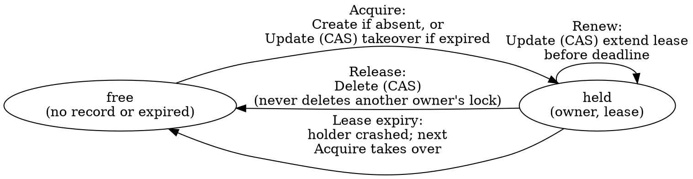

# blobster — Architecture

The design reference for blobster: what the pieces are, how they fit, and the
invariants that hold them together. This is a **living document** — keep it
current as the design evolves, and update it in the same change as the behavior
it describes. For how we work on the project see [`../AGENTS.md`](../AGENTS.md);
for the planning backlog see [`roadmap.md`](roadmap.md); committed work lives in
GitHub issues.

This describes both the implemented foundation and the **target** architecture.
The base `Bucket` API, shared conformance tests, and the `mem`, `file`, `gcs`,
`s3`, and `azureblob` drivers are implemented, as are the lease lock and S3
cross-region copy. The remaining higher-level utilities are planned. The
**backend API facts** the design depends on —
conditional writes, cross-region copy, multipart — are verified against the
providers' docs and Go SDKs; the evidence and exact API surfaces live in
[`cloud-backend-research.md`](cloud-backend-research.md).

## What this project is

blobster is a Go library that turns a **blob store into a general-purpose
substrate**. It models any object store as a flat keyspace of string keys and
provides both the ordinary blob operations (read, write, delete, list,
attributes, server-side copy) and a set of higher utilities that teams normally
reach for a second system to get:

- **parallel multipart upload** for large objects,
- a **distributed lock** for mutual exclusion across processes and hosts,
- **cross-region copy** using each cloud's native copy machinery,
- (exploratory) a **queue** and other coordination primitives.

The thesis: a service that already operates an object store should not need a
lock service, a queue broker, or a metadata database to get these primitives.
The more we can express on blob storage alone, the fewer moving parts a
dependent service has to run, secure, and pay for.

blobster occupies the same layer as a low-level object-store client such as
`gocloud.dev/blob`: a flat keyspace, not a domain model. Callers that want
richer nouns (packages, versions, datasets, …) build them *on top of* blobster.
We deliberately diverge from `gocloud.dev/blob` in two ways that matter for the
goal above — see the invariants.

## Invariants

These hold across the whole system; everything below is built to preserve them.

1. **Blob storage is the only dependency.** Every utility — lock, multipart,
   cross-region copy, a future queue — is expressible as blob operations plus
   one conditional-write primitive. There is no external coordinator (no
   ZooKeeper, etcd, Redis, or database). In-memory state (caches, a lock's
   local lease timer) is allowed but must be reconstructible from the bucket.
2. **Explicit construction, caller-owned clients.** A driver is built from a
   pre-configured native SDK client the caller passes in. blobster does **not**
   use the `gocloud.dev/blob` blank-import + URL-opener registration model: no
   import side effects, no ambient cloud-config discovery, no parsing of a
   connection URL. This maximizes the caller's control over how the native
   client is configured (custom endpoint, credentials provider, retryer,
   transport) and makes the dependency graph explicit. blobster never closes a
   client it did not open. The implemented GCS driver follows this shape with
   `gcs.New(client, bucketName, ...)`, where `client` is a caller-owned
   `*storage.Client`.
3. **A prefix is the root.** A `Bucket` is rooted at a key prefix; every key a
   caller supplies is relative to that root, and `Sub(prefix)` returns another
   `Bucket` rooted deeper. A caller can therefore treat any subtree of a
   physical bucket as an independent blobster bucket. blobster's own bookkeeping
   objects (lock records, multipart state) live under a single reserved prefix
   (`.blobster/`) beneath the root so they never collide with caller keys.
4. **Capabilities are explicit and discoverable.** The base `Bucket` interface
   is the common denominator that *every* driver implements. Anything a backend
   may or may not support is modeled as an **optional interface** plus a
   `Capabilities()` descriptor. Callers feature-gate by type-asserting the
   optional interface or checking the descriptor; they never assume a backend
   can do something it has not advertised. A backend that cannot do something
   says so, rather than failing deep in a call.
5. **Conditional writes are the one coordination primitive.** Optimistic
   concurrency — "write/delete this key only if it is absent / only if its
   current version matches" — is the single mechanism on which all coordination
   (the lock today, a queue later) is built. Every production driver must
   provide it; the implemented `mem`, `file`, `gcs`, and `s3` drivers all
   provide it. `file` emulates it with an atomic write-temp + rename committed
   under a per-bucket lock.
6. **`mem` and `file` are first-class, not test doubles.** They implement the
   same interface and the same conditional semantics as the cloud drivers, so
   unit and local-integration tests run the real code paths. There is no mock
   `Bucket` for storage behavior. Both are implemented and run the shared
   conformance suite in the default test run.

## The base `Bucket` interface

The common denominator every driver implements. Keys are opaque strings
relative to the bucket's root prefix. Reads and writes stream.

```
As(i any) bool
Attributes(ctx, key) (*Attributes, error)  // size, version, content-type, mod time, user metadata
Close() error
Copy(ctx, dstKey, srcKey, *CopyOptions) error
Delete(ctx, key, ...Precondition) error
Download(ctx, key, io.Writer, *ReaderOptions) error
ErrorAs(err, i any) bool
Exists(ctx, key) (bool, error)
IsAccessible(ctx) (bool, error)
List(*ListOptions) *ListIterator
ListPage(ctx, pageToken, pageSize, *ListOptions) ([]*ListObject, nextPageToken, error)
NewRangeReader(ctx, key, offset, length, *ReaderOptions) (Reader, error)
NewReader(ctx, key, *ReaderOptions) (Reader, error)
NewWriter(ctx, key, *WriterOptions) (Writer, error)   // streaming write; commit on Close, abort on CloseWithError
ReadAll(ctx, key) ([]byte, error)
SignedURL(ctx, key, *SignedURLOptions) (string, error)
Sub(prefix) Bucket
Upload(ctx, key, io.Reader, *WriterOptions, ...Precondition) error
WriteAll(ctx, key, []byte, *WriterOptions, ...Precondition) error
Capabilities() Capabilities
```

- **`Attributes`** carries an opaque **version token** (an ETag, a GCS
  generation, an Azure ETag) that feeds conditional operations. blobster does
  not interpret it beyond equality.
- **`NewWriter`** returns a `Writer` whose bytes are committed on `Close`; a
  writer abandoned via `CloseWithError`, its cancelable context, or a context
  cancel must **not** leave a partial, readable object. This matters for
  `mem`/`file`, where a naive close would otherwise commit a truncated body, and
  for cloud drivers where uploads have explicit abort/error-close paths.
- **Preconditions** (next section) are accepted by the write and delete paths
  only. `Copy` is an unconditional server-side copy on every backend — it takes
  no preconditions, matching `gocloud.dev/blob` and avoiding a precondition
  affordance that S3's `CopyObject` (which exposes only *source* conditions)
  could not honor on the destination. Callers needing native source conditions
  use `CopyOptions.BeforeCopy`; callers needing a conditional *result* compose
  `Copy` with a conditional `Delete`/`Write`.
- Convenience `ReadAll`/`WriteAll`/`Upload`/`Download` methods wrap the streaming
  pair for small objects and common copy-to/from-stream cases; the streaming
  reader/writer methods remain the core contract.

`NewRangeReader` carries the byte range explicitly; `WriterOptions` carries
content headers, user metadata, optional MD5 validation, and the same
content-type sniffing controls exposed by Go Cloud; `ListOptions` carries prefix
and delimiter; `ListPage` carries page token and page size. The iterator yields
entries (key, size, mod time, is-prefix) and pages internally. Order is
backend-defined — sort caller-side if it matters.

## Conditional writes (the coordination primitive)

A `Precondition` constrains a write or delete to a backend-checked condition,
evaluated atomically at the storage layer:

```
IfNotExists           // create-only; fails ErrPreconditionFailed if the key exists
IfMatch(version)      // succeed only if the current version token equals this one
IfNotMatch(version)   // succeed only if it differs
```

Mapping per backend:

| Backend | `IfNotExists` | `IfMatch` / `IfNotMatch` |
|--------|---------------|--------------------------|
| `s3`    | `If-None-Match: *` on PUT | `If-Match` / `If-None-Match` on the conditional write |
| `gcs`   | `storage.Conditions{DoesNotExist: true}` | `GenerationMatch` / `GenerationNotMatch` |
| `azureblob` | `If-None-Match: *` | `If-Match` / `If-None-Match` (ETag) |
| `mem`   | in-process compare under a lock | version compare under a lock |
| `file`  | absence check + atomic rename, under a per-bucket lock | sidecar version-token compare + atomic rename, under a per-bucket lock |

A failed precondition is the sentinel `ErrPreconditionFailed`, distinct from
`ErrNotFound`. Conditional support is advertised as the `ConditionalWrites`
capability; a backend without it cannot host the lock or any CAS utility.

All three production backends also support **conditional delete** (S3 natively
since 2025-09; GCS and Azure all along), so a lock's safe release is a single
atomic op — blobster needs no CAS-to-tombstone workaround. Every backend returns
**HTTP 412** on a failed precondition, mapped to `ErrPreconditionFailed`; the
per-SDK error matching is recorded in
[`cloud-backend-research.md`](cloud-backend-research.md).

## Optional capabilities

Each future optional capability is a Go interface a driver may also implement,
paired with a flag in the `Capabilities` descriptor for runtime introspection.
Callers obtain future optional capabilities by type assertion:

```go
if mu, ok := bucket.(blobster.MultipartUploader); ok { /* use native multipart */ }
```

- **`MultipartUploader`** — `NewMultipartUpload`, `UploadPart` (the parts are
  uploaded concurrently by the `multipart` helper), `CompleteMultipartUpload`,
  `AbortMultipartUpload`. Native on S3 (UploadPart), GCS (resumable upload /
  compose), Azure (Put Block + Block List). `mem`/`file` provide a simple local
  implementation so the helper works everywhere.
- **`CrossRegionCopier`** — initiates a backend-native copy that may target a
  different region/bucket and returns a `CopyOperation` handle (some backends
  copy synchronously, some asynchronously — see below).
- **Signed URLs** are exposed on the base bucket because Go Cloud exposes them as
  a basic bucket operation. Drivers that cannot sign return `ErrUnsupported` and
  set `Capabilities().SignedURL` to false. The GCS driver supports signed URLs
  when constructed with `gcs.WithSignedURLs`; the S3 driver always supports them
  via the SDK presigner (GET/PUT/DELETE), so `mem` and `file` are the only
  drivers without signing.
- **`Pinger`** — a cheap reachability probe for readiness checks.

`Capabilities` is a small struct of booleans (`ConditionalWrites`, `Copy`,
`List`, `ListPage`, `RangeRead`, `SignedURL`, and future multipart/cross-region
flags). For future optional interfaces, the interface is the load-bearing
mechanism; the descriptor exists so code can branch, log, or fail fast without a
type assertion per capability.

### Capability matrix (target)

| Capability         | `mem` | `file` | `s3` | `gcs` | `azureblob` |
|--------------------|:-----:|:------:|:----:|:-----:|:-------:|
| Base `Bucket`      |  ✅   |  ✅    | ✅   |  ✅   |  ✅     |
| `ConditionalWrites`|  ✅   |  ✅    | ✅   |  ✅   |  ✅     |
| `MultipartUploader`|  ✅¹  |  ✅¹   | ✅   |  ✅   |  ✅     |
| `CrossRegionCopier`|  ❌   |  ❌    | ✅   |  🔜³  |  🔜³    |
| Signed URLs        |  ❌   |  ❌    | ✅   |  ✅²  |  ✅     |
| `Pinger`           |  ✅   |  ✅    | ✅   |  ✅   |  ✅     |

¹ local (non-native) implementation — correct, but not a true server-side
multipart. ² requires `gcs.WithSignedURLs`. ³ planned — the mechanism is verified
(GCS `rewrite`, Azure async `Copy Blob`) but not yet implemented, so these
drivers neither satisfy `CrossRegionCopier` nor set `Capabilities.CrossRegionCopy`
today.

`mem` and `file` deliberately do **not** implement `CrossRegionCopier`: there is
no region to cross and no server-side transfer to orchestrate, so synthesizing
one would add a code path the cloud drivers never share. Cross-region copy is the
one optional capability with no `mem`/`file` stand-in; its handle and async
contract are unit-tested directly in the root package.

Implemented today: base `Bucket`, conditional writes, copy, list/list-page,
range reads for `mem`, `file`, `gcs`, `s3`, and `azureblob`; signed URLs for `gcs`
(with `WithSignedURLs`), `s3`, and `azureblob`; cross-region copy for `s3`
(`CopyObject` plus multipart `UploadPartCopy` above the single-copy size limit).
Multipart, cross-region copy for `gcs` and `azureblob`, and pinger are planned.

The `s3` driver wraps a caller-owned `*s3.Client` (`s3.New(client, bucket,
...)`): conditional writes map to `If-None-Match`/`If-Match` on PutObject and
the multipart-complete path; streaming writes go through the SDK's upload
manager over an `io.Pipe`; range reads reopen a `GetObject` per seek. `Copy` is
a server-side `CopyObject` (the base `Copy` is unconditional on every backend).
Conditional delete uses `If-Match` (the only destination condition DeleteObject
accepts).

### S3-compatible backends (Cloudflare R2)

R2 speaks the S3 API, so it needs **no driver of its own**. Per invariant 2 the
`s3` driver is built from a caller-owned `*s3.Client`; the caller points that
client at R2's endpoint (`https://<account-id>.r2.cloudflarestorage.com`, region
`auto`) and uses `s3.New` unchanged. A separate `r2` package would only re-wrap
the same client and duplicate `s3`, so blobster deliberately does not ship one —
the work is configuring the client correctly and knowing which capabilities R2
honors, both verified by `TestCloudBucketR2` in `s3/s3_cloud_test.go`.

- **The SDK checksum default must be turned off.** Recent `aws-sdk-go-v2`
  releases compute a CRC32 request checksum by default; R2 rejects it (`Header
  'x-amz-checksum-algorithm' with value 'CRC32' not implemented`) and every
  `PutObject`/`UploadPart` fails. Build the client with
  `RequestChecksumCalculation` and `ResponseChecksumValidation` set to
  *when-required*. This is the caller's job (invariant 2 keeps blobster out of
  client config), but without it nothing writes.
- **Conditional writes hold.** R2 honors `If-None-Match: *` (create-only) and
  `If-Match`/`If-None-Match` on `PutObject`/`CopyObject`, returning 412, so the
  `ConditionalWrites` capability is real and the lock's acquire / renew / takeover
  path works unchanged.
- **Conditional delete is the one gap.** R2 does not document `If-Match` on
  `DeleteObject` (S3 itself only gained it in 2025-09). The `s3` driver's
  conditional `Delete` therefore cannot be relied on against R2, so the lock's
  *safe release* (delete-only-if-still-mine) loses its guarantee there; the lock
  still functions via lease expiry/takeover, but a holder cannot prove it deleted
  only its own record. `Capabilities()` cannot reflect this — the driver does not
  know it is talking to R2 — so a caller needing the release guarantee must gate on
  the backend, not on the descriptor. The conformance suite's conditional-delete
  case is what surfaces the actual R2 behavior.
- **There is no real cross-region copy.** R2 has no S3-style regions (it is
  global, with optional jurisdictions), so `CopyObject` works intra-bucket but
  there is no region to cross.
- **Multipart and signed URLs hold.** R2 implements native S3 multipart and SigV4
  presigning.

The `file` driver splits storage into three sibling subtrees under the bucket
root — `data/<key>` for object bytes, `meta/<key>` for a JSON sidecar (content
headers, user metadata, MD5, size, opaque version token), and `tmp/` for
in-flight writes. Keeping metadata and temp files in their own trees means no
caller key can collide with bookkeeping state, so the full string keyspace stays
addressable (unlike a single-tree `<key>.attrs` sidecar scheme, which must
reject or escape keys ending in the sidecar suffix). Writes stream to a temp
file and commit under a per-bucket lock: the precondition is checked against the
committed sidecar, the data file is renamed into place first (it is the
existence source of truth), then the sidecar — and readers take the same lock
while opening committed state, so a half-applied commit is never observed.
`Copy` reads the source bytes and writes them to the destination with a fresh
version token and create/mod time, matching `mem`/`gcs`/`s3` (and diverging from
`gocloud.dev/blob/fileblob`, which preserves the source's metadata) so every
object carries its own identity.

The `azureblob` driver wraps a caller-owned `*container.Client` (`azureblob.New(client,
...)`) — an Azure container is the unit that maps to a blobster bucket, so the
container client carries both the account endpoint and the container name, and
no separate name argument is needed. Conditional writes map to
`If-None-Match: *` (create-only) and `If-Match`/`If-None-Match` ETag conditions
via `blob.ModifiedAccessConditions`, on both the write and delete paths. The
version token is the blob's ETag. Streaming writes go through the block-blob
`UploadStream` API over an `io.Pipe`; range reads reopen a `DownloadStream` per
seek. A caller-supplied `ContentMD5` is enforced atomically server-side by
routing the (necessarily bounded) body through a single `Put Blob` with a
transactional Content-MD5 — `UploadStream` cannot validate a whole-object MD5
across blocks, so unvalidated writes stay streaming and never buffer the whole
blob while validated writes buffer. `Copy` is `Copy Blob`, which is
asynchronous: the driver starts the copy and polls the destination's copy
status to completion so the base synchronous `Copy` contract holds (same-account
copies typically complete on the first poll; a few transient `GetProperties`
failures during polling are tolerated before giving up). Signed URLs use the
blob client's `GetSASURL`, which requires the container client to carry a
shared-key credential; because `GetSASURL` signs only the path, permissions, and
expiry, the driver returns `ErrUnsupported` when a signed URL is asked to enforce
a Content-Type rather than silently dropping it.

Unlike the other drivers, `azureblob` **escapes keys and metadata** at the
backend boundary, because Azure cannot address some characters and only accepts
C# identifiers as metadata names. Blob keys hex-escape control characters,
`"`, `#`, `%`, `?`, `\`, a trailing `/`, and the slash in `../` to
`__0x<hex>__`; metadata keys hex-escape to valid identifiers and metadata values
are URL-escaped. The scheme matches `gocloud.dev/blob/azureblob` so blobs and
metadata round-trip between the two, and listing reverses it so callers always
see their original keys. (`s3`/`gcs` pass keys through unescaped — Azure is the
strict outlier.)

## Testing

The shared `blobtest` conformance suite defines the base bucket contract. The
default test run exercises it against `mem` and `file` (real implementations,
the latter via `t.TempDir()`) and against fake-backed `gcs`/`s3`/`azureblob` wrappers
(mem-backed) that verify the prefix/list/precondition plumbing without a network.
The cloud drivers' real backends run the same suite behind the `cloud` build
tag:

```sh
BLOBSTER_GCS_BUCKET=my-test-bucket go test -tags cloud ./gcs
BLOBSTER_S3_BUCKET=my-test-bucket  go test -tags cloud ./s3
BLOBSTER_AZURE_CONNECTION_STRING=... BLOBSTER_AZURE_CONTAINER=my-container go test -tags cloud ./azureblob

# R2 reuses the s3 driver against R2's endpoint (S3-compatible, no separate driver):
BLOBSTER_R2_BUCKET=my-bucket BLOBSTER_R2_ENDPOINT=https://<acct>.r2.cloudflarestorage.com \
  BLOBSTER_R2_ACCESS_KEY_ID=... BLOBSTER_R2_SECRET_ACCESS_KEY=... go test -tags cloud ./s3
```

GCS uses standard Google Application Default Credentials; S3 uses the standard
AWS default credential/region chain (`config.LoadDefaultConfig`); Azure uses a
shared-key connection string (which also enables SAS signing). Each test writes
under a unique prefix it attempts to clean up; `BLOBSTER_GCS_PREFIX` /
`BLOBSTER_S3_PREFIX` / `BLOBSTER_AZURE_PREFIX` force all test objects under a
chosen prefix. See [`cloud-tests.md`](cloud-tests.md) for credential and
permission details.

## Distributed lock (lease)

A lock is a **generic lease algorithm over one conditional-write primitive**,
not per-driver code. The lock lives in the **root `blobster` package** (it is a
core coordination primitive and depends only on the root contract, so it is
surfaced at the top level rather than in its own folder, unlike the heavier,
capability-gated `multipart` utility). A `Locker` is constructed with
`blobster.NewLocker(bucket, …)` over any `blobster.Bucket` that advertises
`ConditionalWrites`, so a caller builds a native client once and uses the same
driver for both blob operations and locking. Internally the lease logic needs
only four conditional ops on a single key — read, create-if-absent,
CAS-if-version-matches, delete-if-version-matches — expressed directly over the
bucket's `Attributes`/`WriteAll`/`Delete` and reusing the package's existing
sentinels (`ErrNotFound`, `ErrPreconditionFailed`); it has no error vocabulary
of its own. (Azure has a native `Lease Blob` API, but blobster builds on uniform
CAS everywhere; a native lease is at most an optional Azure-specific optimization
reachable via `As`, never the core algorithm.)

`NewLocker` acquires many distinct locks by key from one bucket+location
(`WithLockPrefix`, default `.blobster/locks/`). `Acquire`/`TryAcquire` take a key
and an optional `WithLockOwner` (a random owner is generated otherwise). The
opaque version token (ETag/generation) is handled entirely inside the package —
callers never see it. The background renewer runs on an **internal context**,
independent of the context passed to `Acquire`: it is stopped only by `Release`
or by losing the lease, so a request-scoped acquire context cancelling does not
kill the renewer.

A lock named `N` is backed by a single record at `.blobster/locks/<N>` whose
state lives in the object's **user metadata** (empty body), so one `Get`
(`Attributes`) returns both the state and the version token atomically:

```
owner        — id of the current holder (advisory; for logs / "who holds this")
lease         — absolute deadline (RFC3339Nano) after which the lease is expired
```



- **Acquire** creates the record if absent. If it exists but its `lease` is in
  the past, the acquirer takes over with a CAS on the stale version. The
  compare-and-swap guarantees exactly one winner under contention;
  `TryAcquire` returns `ErrLockHeld` when a live holder owns it, while `Acquire`
  retries with jittered backoff until acquired or the context is done.
- **Hold** runs a background renewer that extends `lease` via CAS each renew
  interval. The renewer self-expires conservatively: if its own deadline passes
  before a renew lands (or a renew CAS conflicts because someone took over), it
  declares the lock lost via the handle's `Done()`/`Err()` — liveness only, see
  below.
- **Release** stops the renewer and waits for it to exit (so no in-flight renew
  can race the delete), then deletes the record only if it still names this
  owner — so a process can never delete a lock that has since been taken over,
  and an explicit Release leaves no stale record holding the lock until expiry.
  It is idempotent and a safe no-op once the lock was lost. Its returned error
  is authoritative for whether cleanup succeeded; `Err` is reserved for the
  held-time lost-vs-clean distinction.

**No fencing token — and why.** This is a lease lock, not a fencing lock. It
gives mutual exclusion in the common case and self-heals on crash, but it does
**not** protect against a holder that pauses (GC, VM freeze) past its lease and
resumes after a successor starts — a frozen process cannot observe its own
freeze, so no self-check (`IsExpired`-style) can be safe, and the handle's
loss signal is therefore documented as liveness, never a correctness guard. We
deliberately do not surface a fencing token: the lock's purpose is to coordinate
critical sections that span **multiple objects or external systems**, where a
single monotonic token would only partially help and would force every protected
resource to implement fence-checking. Safety under arbitrary pauses is the
caller's responsibility — keep sections short and make effects idempotent. Note
that when the protected resource is a single blobster object, its own
conditional write (`IfMatch` on the object's version) already orders writers and
rejects a stale holder's overwrite, so no separate token is needed there.

**Backend constraint on timing.** GCS throttles writes to ~1 per second *per
object name*. Because the lock record is a single hot object, lease and renew
intervals are second-scale (default lease 15s, renew lease/3), not sub-second,
with jittered acquire backoff. This sets the floor for the renew/lease margin
uniformly across backends — see
[`cloud-backend-research.md`](cloud-backend-research.md).

## Multipart parallel upload

The `multipart` package is a generic helper over the `MultipartUploader`
capability. Given a large source and options (`PartSize`, `Concurrency`), it
splits the source into parts, uploads them with bounded parallelism, and
completes the upload — aborting and cleaning up parts on any error or context
cancellation so a failed upload leaves no orphaned multipart state. Where the
backend lacks native multipart (`mem`/`file`), the local implementation behind
the same interface keeps the helper usable in tests and for small/local
deployments. Resumable uploads (persisting an upload id for later continuation)
are a backlog item, not part of the first cut.

**The interface is backend-honest, not S3-mirrored.** Only S3 has a native
upload-id / part / complete / abort model. GCS uses **compose** (parallel
composite upload over temp components placed under `.blobster/multipart/`; the
S3-compatible XML multipart API is unavailable in the Go SDK, so blobster does
not use it), and Azure uses **block blobs** (`StageBlock` + `CommitBlockList`).
Consequently `uploadID` and the per-part token are **blobster-owned opaque
values** — real handles on S3, synthesized on GCS/Azure — and `Abort` is
**best-effort cleanup**: S3 calls the real abort, GCS deletes its temp
components, Azure relies on uncommitted-block GC. Azure offers no per-upload
isolation on a key, so part/block ids are namespaced by `uploadID`. Per-backend
mechanisms and limits are in
[`cloud-backend-research.md`](cloud-backend-research.md).

## Cross-region copy

Cross-region copy is an **optional capability on the driver**, not a separate
orchestration package. A backend that can copy server-side to another
region/bucket/account implements `CrossRegionCopier.XCopyFrom`, which takes the
**destination key, a separate source `Bucket`, and the source key**, and uses the
cloud's native mechanism so bytes never round-trip through the caller:

- **S3** — `CopyObject` for objects within S3's single-copy size limit (5 GiB);
  multipart `UploadPartCopy` (concurrent ranged part-copies, source metadata
  mirrored onto the destination, abort on any failure or cancellation) for
  larger objects. The copy is issued against the **destination** bucket's client
  and names the source bucket in `x-amz-copy-source`; the source `Bucket` is just
  identity, so no second client is threaded. *(Implemented.)*
- **GCS** — the `rewrite` operation, which handles cross-region and cross-bucket
  copies and is resumable via a rewrite token. *(Planned.)*
- **Azure** — `Copy Blob`, which is **asynchronous**: it returns a copy id and
  the destination's copy status is polled to completion. *(Planned.)*

**The capability returns immediately with an async handle.** `XCopyFrom` does not
block; it returns a `CopyOperation` whose `Done()` channel closes when the copy
reaches a terminal state and whose `Err()` then reports success, failure, or
cancellation. The handle and helper (`StartCopyOperation`) live in the **root
`blobster` package** — like the lock — because the optional interface (on the
driver) must reference the handle type, and a driver may import only root. A
driver runs its native copy (which may itself block, as S3's does, or poll, as
Azure's will) inside the goroutine `StartCopyOperation` manages, so the
"start-and-observe" shape is uniform across synchronous and asynchronous
backends without per-driver channel plumbing. The `ctx` passed to `XCopyFrom`
governs the **lifetime of the whole copy**, not just the call; cancelling it
requests best-effort cancellation, and because the transfer is server-side the
destination may or may not exist afterward. A synchronous setup failure (e.g. the
source is a different backend — `ErrUnsupported`) is returned directly and yields
no handle.

**The handle is in-memory only — for now, by construction choice.** Today, if the
process exits while a copy is in flight, its outcome cannot be observed: there is
no persisted record to re-attach to. This is the default and the only mode in the
first cut, but it is deliberately *not* a dead end. The intended evolution is a
**driver-construction option** (e.g. a `WithPersistentCopyHandle`-style option on
the cloud driver) that opts a bucket into persisting an operation record — plus
each backend's resume token (S3 multipart upload-id, GCS rewrite token, Azure
copy-id) — under `.blobster/xcopy/`, so another process (or the same one after a
restart) can recover or re-poll an in-flight copy. The current API is shaped to
keep this purely additive: `XCopyFrom` still returns a `CopyOperation`, and the
persistent mode would back that same handle with bucket state rather than change
the signature. It pays off mainly for the genuinely resumable backends, so it is
a future opt-in rather than the default — not ruled out, just not the first cut
(S3's atomic `CopyObject` has nothing to resume regardless).

**Azure cross-account needs a source read-SAS — a deliberately contained leak.**
Azure's `Copy Blob` authorizes against the destination, so a cross-account source
must carry a short-lived read SAS minted from the source's own credential (the
SAS URL is a bearer credential and must never be logged). The generic
`CopyOptions` cannot express this — it needs the source's credential, not the
destination's — so when the Azure driver lands, the SAS is supplied through an
**`azureblob`-package-specific option** (an explicit source URL/SAS, or a
source-bucket signing policy) rather than a field on root `CopyOptions`, keeping
the root interface cloud-neutral. Same-account copies (including cross-region
within one account) need no SAS. This is an open design point tracked in the
roadmap.

**Verified constraints** (see [`cloud-backend-research.md`](cloud-backend-research.md)):
cross-region copy is genuinely server-side on all three, but S3's only works
*within one AWS partition* (`aws` / `aws-cn` / `aws-us-gov` cannot be crossed,
and Transfer Acceleration and VPC gateway endpoints break it); GCS must drive the
`rewrite` token loop (the single-shot `copy` fails on large or cross-location
objects) via the global endpoint; and Azure requires a **read SAS on a
cross-account source** — which must never be logged — and permits only one
pending copy per destination.

## Code layout

The repository stays flat: the user-facing interfaces and shared types live in
the root `blobster` package; everything with substantial implementation gets its
own folder; docs live under `docs/`. The lock is the one deliberate exception —
it depends only on the root contract and is a core primitive, so it lives in the
root package rather than its own folder.

```
blobster/            ← root package: Bucket + optional capability interfaces,
                       Attributes, Precondition/conditions, errors, Capabilities,
                       the lease lock (Locker, Lock, NewLocker over a Bucket), and
                       the cross-region copy handle (CopyOperation,
                       StartCopyOperation) backing the CrossRegionCopier capability
multipart/           ← parallel-upload helper over MultipartUploader
mem/                 ← in-memory driver (reference implementation + test substrate)
file/                ← filesystem driver (local integration + small deployments)
s3/                  ← AWS S3 driver (wraps a caller-owned *s3.Client)
gcs/                 ← Google Cloud Storage driver (wraps *storage.Client)
azureblob/           ← Azure Blob driver (wraps the container client)
internal/            ← shared etag/condition plumbing, not part of the public API
docs/
  architecture.md    ← this document
  roadmap.md         ← planning backlog
  cloud-backend-research.md  ← verified backend API facts behind the design
AGENTS.md            ← how we work  (CLAUDE.md is a symlink to it)
README.md  LICENSE  go.mod  Makefile
```

### Dependency rule

```
                     multipart/             (utility: depends on root interfaces only)
                         │
                         ▼
        blobster (root: interfaces + types + lease lock + cross-region copy handle)
                         ▲
                         │
   mem/ file/ s3/ gcs/ azureblob/  (drivers: implement root interfaces; import only root)
```

- Drivers import **only** the root `blobster` package (and their native SDK).
- The lease lock lives in the root package; it depends only on the root
  contract (no driver imports), so surfacing it at the top level keeps the
  dependency graph one-directional.
- The `multipart` utility package depends on the root **interfaces**, never on a
  concrete driver — so it works against any backend that advertises the needed
  capability. Cross-region copy is not a utility package: its capability
  (`CrossRegionCopier`) is implemented directly on each cloud driver and its
  handle (`CopyOperation`) lives in root, mirroring the lock.
- No driver imports another driver. The arrows point one way.

## Reserved keys and the root prefix

A blobster bucket is rooted at a prefix; all caller keys are relative to it.
blobster's own objects live under a single reserved sub-prefix so they are
invisible to and uncollidable with caller data:

```
<root>/<caller keys…>
<root>/.blobster/locks/<name>          ← lock records
<root>/.blobster/multipart/<id>/…      ← in-flight multipart bookkeeping (where emulated)
```

Listing the bucket's caller-visible contents excludes the `.blobster/` subtree.
`Sub(prefix)` composes prefixes, and each re-rooted bucket gets its own
`.blobster/` namespace beneath its root.

## Errors

Sentinel errors live in the root package and are `errors.Is`-matchable:
`ErrNotFound`, `ErrPreconditionFailed`, `ErrUnsupported` (a capability the
backend does not provide), and `ErrInvalidOption`. Drivers map native backend
errors onto these so callers write backend-agnostic error handling. The lock
adds `ErrLockHeld` (a live holder owns it), `ErrLockLost` (lease could not be
renewed), and `ErrInvalidLockKey`; internally it reuses `ErrNotFound` and
`ErrPreconditionFailed` to interpret the bucket's conditional ops rather than
introducing parallel sentinels.

## Non-goals / deferred

- **A domain model.** blobster is a flat keyspace plus utilities; nouns like
  packages/datasets are the caller's job.
- **Cross-key transactions.** The only atomicity blobster offers is
  single-object conditional writes; there is no multi-key transaction.
- **A POSIX filesystem.** No partial in-place edits, no rename-as-move
  semantics beyond what `Copy` + `Delete` express.
- **Resumable multipart** (persisting an upload id across processes) — backlog.
- **The queue and other coordination primitives** — exploratory; see
  `roadmap.md`.
- **Ambient configuration / driver auto-registration** — intentionally absent;
  see invariant 2.
